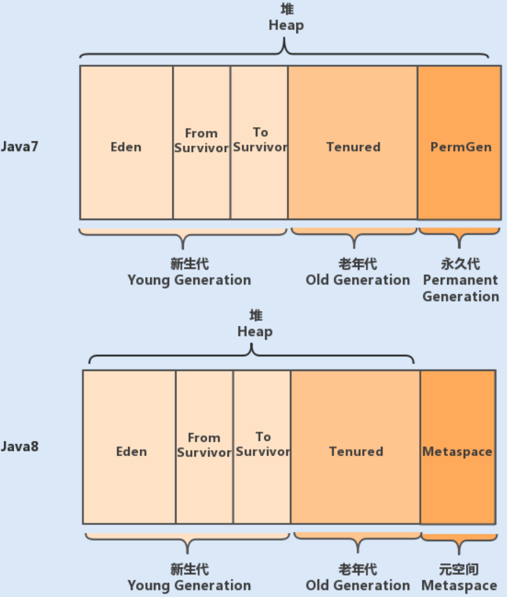

# 020-JVM内存模型的具体设计

[TOC]

## JVM内存模型图

我们先通过一张 JVM 内存模型图，来熟悉下其具体设计。在 Java 中，JVM 内存模型主要分为堆、程序计数器、方法区、虚拟机栈和本地方法栈。

## 1. 堆（Heap）

 [03-Java堆.md](../../../07-jvm/02-Java内存区域与内存溢出异常/03-Java堆.md) 

堆是 JVM 内存中最大的一块内存空间，该内存被所有线程共享，几乎所有对象和数组都被分配到了堆内存中。

- 堆被划分为新生代和老年代，新生代又被进一步划分为 Eden 和 Survivor 区，最后 Survivor 由 From Survivor 和 To Survivor 组成。

#### 各个版本的永久代

- 在 Java6 版本中，永久代在非堆内存区；

- 到了 Java7 版本，永久代的静态变量和运行时常量池被合并到了堆中；

- 而到了 Java8，永久代被元空间取代了。 

结构如下图所示：

## 2. 程序计数器（Program Counter Register）

 [01-程序计数器.md](../../../07-jvm/02-Java内存区域与内存溢出异常/01-程序计数器.md) 

程序计数器是一块很小的内存空间，主要用来记录各个线程执行的字节码的地址，例如，分支、循环、跳转、异常、线程恢复等都依赖于计数器。

由于 Java 是多线程语言，当执行的线程数量超过 CPU 数量时，线程之间会根据时间片轮询争夺 CPU 资源。

如果一个线程的时间片用完了，或者是其它原因导致这个线程的 CPU 资源被提前抢夺，那么这个退出的线程就需要单独的一个程序计数器，来记录下一条运行的指令。

## 3. 方法区（Method Area）

很多开发者都习惯将方法区称为“永久代”，其实这两者并不是等价的。

 [04-方法区.md](../../../07-jvm/02-Java内存区域与内存溢出异常/04-方法区.md) 

HotSpot 虚拟机使用永久代来实现方法区，但在其它虚拟机中，例如，Oracle 的 JRockit、IBM 的 J9 就不存在永久代一说。

因此，方法区只是 JVM 中规范的一部分，可以说，在 HotSpot 虚拟机中，设计人员使用了永久代来实现了 JVM 规范的方法区。

**方法区主要是用来存放已被虚拟机加载的类相关信息，包括类信息、运行时常量池、字符串常量池。**

类信息又包括了类的版本、字段、方法、接口和父类等信息。

#### JVM执行类的流程

JVM 在执行某个类的时候，必须经过加载、连接、初始化，而连接又包括验证、准备、解析三个阶段。

#### 加载阶段

在加载类的时候，JVM 会先加载 class 文件，而在 class 文件中除了有类的版本、字段、方法和接口等描述信息外，还有一项信息是常量池 (Constant Pool Table)，用于存放编译期间生成的各种字面量和符号引用。

- 字面量包括字符串（String a=“b”）、基本类型的常量（final 修饰的变量）
- 符号引用则包括类和方法的全限定名（例如 String 这个类，它的全限定名就是 Java/lang/String）、字段的名称和描述符以及方法的名称和描述符。

而当类加载到内存中后，JVM 就会将 class 文件常量池中的内容存放到运行时的常量池中；

#### 解析阶段

在解析阶段，JVM 会把符号引用替换为直接引用（对象的索引值）。

例如，类中的一个字符串常量在 class 文件中时，存放在 class 文件常量池中的；

在 JVM 加载完类之后，JVM 会将这个字符串常量放到运行时常量池中，并在解析阶段，指定该字符串对象的索引值。运行时常量池是全局共享的，多个类共用一个运行时常量池，class 文件中常量池多个相同的字符串在运行时常量池只会存在一份。

方法区与堆空间类似，也是一个共享内存区，所以方法区是线程共享的。假如两个线程都试图访问方法区中的同一个类信息，而这个类还没有装入 JVM，那么此时就只允许一个线程去加载它，另一个线程必须等待。

在 HotSpot 虚拟机、Java7 版本中已经将永久代的静态变量和运行时常量池转移到了堆中，其余部分则存储在 JVM 的非堆内存中，而 Java8 版本已经将方法区中实现的永久代去掉了，并用元空间（class metadata）代替了之前的永久代，并且元空间的存储位置是本地内存。

之前永久代的类的元数据存储在了元空间，永久代的静态变量（class static variables）以及运行时常量池（runtime constant pool）则跟 Java7 一样，转移到了堆中。

**那你可能又有疑问了，Java8 为什么使用元空间替代永久代，这样做有什么好处呢？**

官方给出的解释是：

- 移除永久代是为了融合 HotSpot JVM 与 JRockit VM 而做出的努力，因为 JRockit 没有永久代，所以不需要配置永久代。
- 永久代内存经常不够用或发生内存溢出，爆出异常 java.lang.OutOfMemoryError: PermGen。

这是因为在 JDK1.7 版本中，指定的 PermGen 区大小为 8M，由于 PermGen 中类的元数据信息在每次 FullGC 的时候都可能被收集，回收率都偏低，成绩很难令人满意；还有，为 PermGen 分配多大的空间很难确定，PermSize 的大小依赖于很多因素，比如，JVM 加载的 class 总数、常量池的大小和方法的大小等。

## 4. 虚拟机栈（VM stack）

 [02-Java虚拟机栈.md](../../../07-jvm/02-Java内存区域与内存溢出异常/02-Java虚拟机栈.md) 

Java 虚拟机栈是线程私有的内存空间，它和 Java 线程一起创建。当创建一个线程时，会在虚拟机栈中申请一个线程栈，用来保存方法的局部变量、操作数栈、动态链接方法和返回地址等信息，并参与方法的调用和返回。

每一个方法的调用都伴随着栈帧的入栈操作，方法的返回则是栈帧的出栈操作。

## 5. 本地方法栈（Native Method Stack）

本地方法栈跟 Java 虚拟机栈的功能类似，Java 虚拟机栈用于管理 Java 函数的调用，而本地方法栈则用于管理本地方法的调用。但本地方法并不是用 Java 实现的，而是由 C 语言实现的。