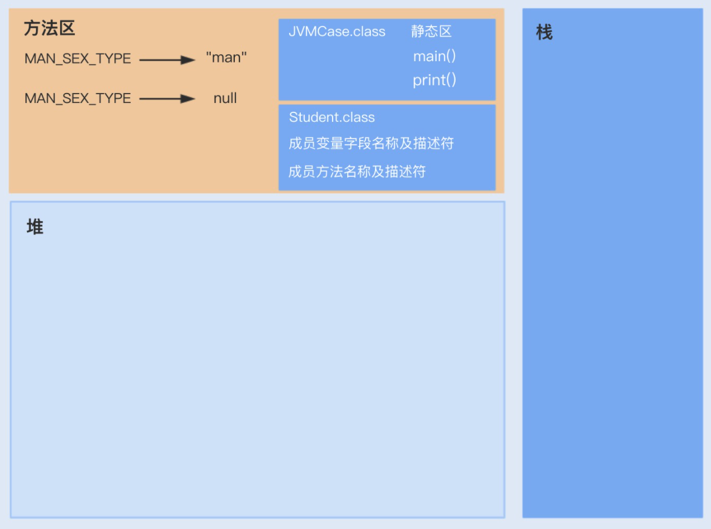
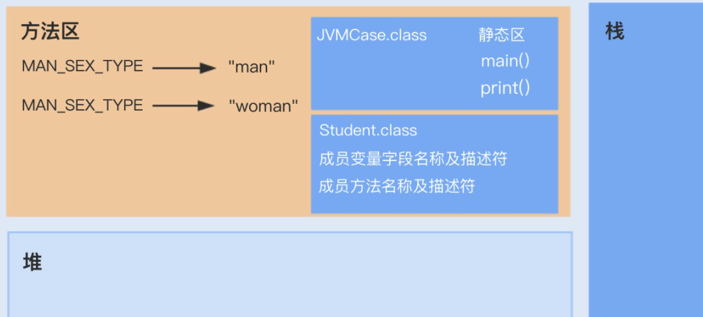
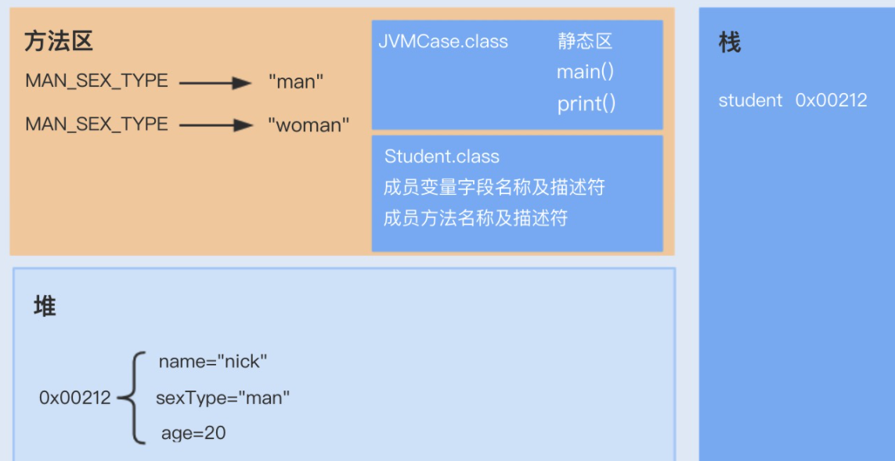
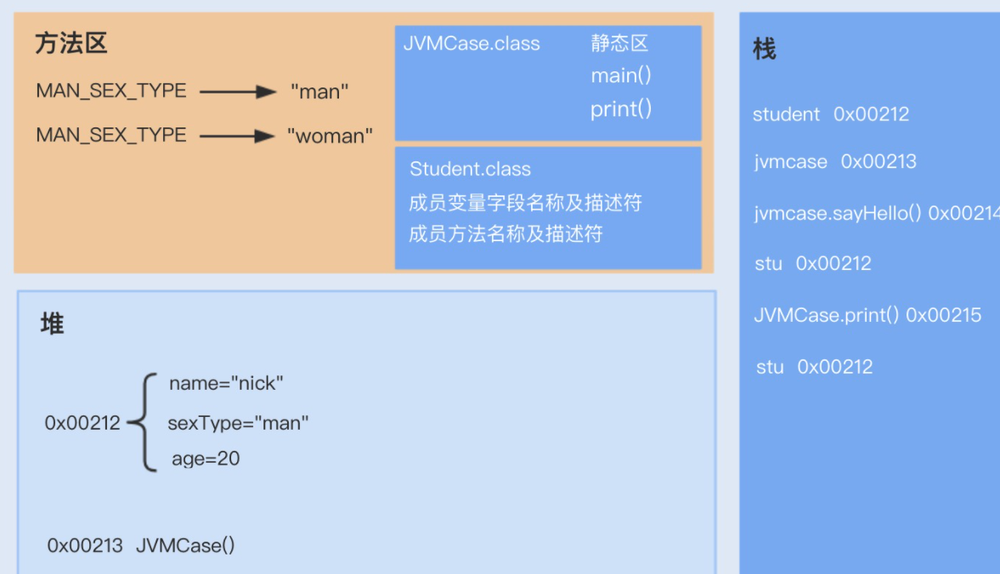

# 030-JVM的运行原理

[TOC]

我们通过一个案例来了解下代码和对象是如何分配存储的，Java 代码又是如何在 JVM 中运行的

```java
public class JVMCase {
 
	// 常量
	public final static String MAN_SEX_TYPE = "man";
 
	// 静态变量
	public static String WOMAN_SEX_TYPE = "woman";
 
	public static void main(String[] args) {
		
		Student stu = new Student();
		stu.setName("nick");
		stu.setSexType(MAN_SEX_TYPE);
		stu.setAge(20);
		
		JVMCase jvmcase = new JVMCase();
		
		// 调用静态方法
		print(stu);
		// 调用非静态方法
		jvmcase.sayHello(stu);
	}
 
 
	// 常规静态方法
	public static void print(Student stu) {
		System.out.println("name: " + stu.getName() + "; sex:" + stu.getSexType() + "; age:" + stu.getAge()); 
	}
 
 
	// 非静态方法
	public void sayHello(Student stu) {
		System.out.println(stu.getName() + "say: hello"); 
	}
}
 
class Student{
	String name;
	String sexType;
	int age;
	
	public String getName() {
		return name;
	}
	public void setName(String name) {
		this.name = name;
	}
	
	public String getSexType() {
		return sexType;
	}
	public void setSexType(String sexType) {
		this.sexType = sexType;
	}
	public int getAge() {
		return age;
	}
	public void setAge(int age) {
		this.age = age;
	}
}
```

## 当我们通过Java运行以上代码时，JVM的整个处理过程如下

1. JVM 向操作系统申请内存，JVM 第一步就是通过配置参数或者默认配置参数向操作系统申请内存空间，根据内存大小找到具体的内存分配表，然后把内存段的起始地址和终止地址分配给 JVM，接下来 JVM 就进行内部分配。

2. JVM 获得内存空间后，会根据配置参数分配堆、栈以及方法区的内存大小。

3. class 文件加载、验证、准备以及解析，其中准备阶段会为类的静态变量分配内存，初始化为系统的初始值。



4. 完成上一个步骤后，将会进行最后一个初始化阶段。在这个阶段中，JVM 首先会执行构造器` <clinit> `方法，编译器会在.java 文件被编译成.class 文件时，收集所有类的初始化代码，包括静态变量赋值语句、静态代码块、静态方法，收集在一起成为` <clinit>() `方法。



5. 执行方法。启动 main 线程，执行 main 方法，开始执行第一行代码。此时堆内存中会创建一个 student 对象，对象引用 student 就存放在栈中。



6. 此时再次创建一个 JVMCase 对象，调用 sayHello 非静态方法，sayHello 方法属于对象 JVMCase，此时 sayHello 方法入栈，并通过栈中的 student 引用调用堆中的 Student 对象；之后，调用静态方法 print，print 静态方法属于 JVMCase 类，是从静态方法中获取，之后放入到栈中，也是通过 student 引用调用堆中的 student 对象。



了解完实际代码在 JVM 中分配的内存空间以及运行原理，相信你会更加清楚内存模型中各个区域的职责分工。

## 总结

这讲我们主要深入学习了最基础的内存模型设计，了解其各个分区的作用及实现原理。

如今，JVM 在很大程度上减轻了 Java 开发人员投入到对象生命周期的管理精力。在使用对象的时候，JVM 会自动分配内存给对象，在不使用的时候，垃圾回收器会自动回收对象，释放占用的内存。

但在某些情况下，正常的生命周期不是最优的选择，有些对象按照 JVM 默认的方式，创建成本会很高。比如，我在[第 03 讲](https://time.geekbang.org/column/article/97215)讲到的 String 对象，在特定的场景使用 String.intern 可以很大程度地节约内存成本。我们可以使用不同的引用类型，改变一个对象的正常生命周期，从而提高 JVM 的回收效率，这也是 JVM 性能调优的一种方式。

## 思考题

这讲我只提到了堆内存中对象分配内存空间的过程，那如果有一个类中定义了 

```
String a="b";
String c = new String(“b”)
```

请问这两个对象会分别创建在 JVM 内存模型中的哪块区域呢？

- String a="b"可能创建一个对象或者不创建对象
  - 如果"b"这个字符串在常量池里不存在会在常量池创建一个String对象"b"
  - 如果已经存在则a直接reference to这个常量池里的对象;

- String c= new String("b")至少创建一个对象,也可能两个,
  - 因为用到new关键字,会在堆内在创建一个的String对象,它的值是"b"。
  - 同时,如果"b"这个字符串在常量池里不存在,会在常量池创建这个一个String对象"b"。