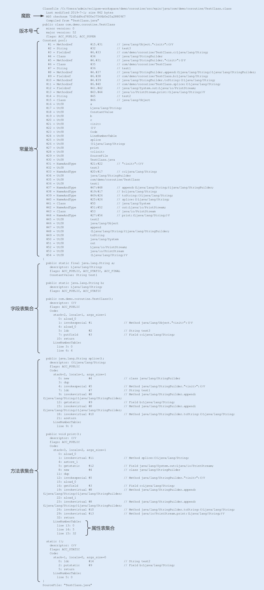

# 030-类编译

[TOC]

## 1.类编译

在编写好代码之后，我们需要将 .java 文件编译成 .class 文件，才能在虚拟机上正常运行代码。文件的编译通常是由 JDK 中自带的 Javac 工具完成，一个简单的 .java 文件，我们可以通过 javac 命令来生成 .class 文件。

下面我们通过 javap（ [第 12 讲](https://time.geekbang.org/column/article/101244) 讲过如何使用 javap 反编译命令行）反编译来看看一个 class 文件结构中主要包含了哪些信息：

看似一个简单的命令执行，前期编译的过程其实是非常复杂的，包括词法分析、填充符号表、注解处理、语义分析以及生成 class 文件，这个过程我们不用过多关注。

只要从上图中知道，编译后的字节码文件主要包括常量池和方法表集合这两部分就可以了。

## 常量池

常量池主要记录的是类文件中出现的字面量以及符号引用。

- 字面常量包括字符串常量（例如 String str=“abc”，其中"abc"就是常量），声明为 final 的属性以及一些基本类型（例如，范围在 -127-128 之间的整型）的属性。符号引用包括类和接口的全限定名、类引用、方法引用以及成员变量引用（例如 String str=“abc”，其中 str 就是成员变量引用）等。

方法表集合中主要包含一些方法的字节码、方法访问权限（public、protect、prviate 等）、方法名索引（与常量池中的方法引用对应）、描述符索引、JVM 执行指令以及属性集合等。

