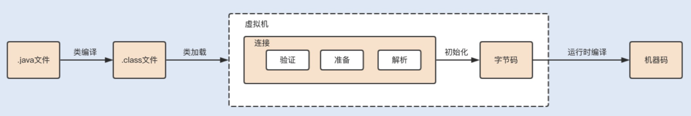

# 020-类加载

[TOC]



### 2.类加载

当一个类被创建实例或者被其它对象引用时，虚拟机在没有加载过该类的情况下，会通过类加载器将字节码文件加载到内存中。

不同的实现类由不同的类加载器加载，JDK 中的本地方法类一般由根加载器（Bootstrp loader）加载进来，JDK 中内部实现的扩展类一般由扩展加载器（ExtClassLoader ）实现加载，而程序中的类文件则由系统加载器（AppClassLoader ）实现加载。

在类加载后，class 类文件中的常量池信息以及其它数据会被保存到 JVM 内存的方法区中。

### 3.类连接

类在加载进来之后，会进行连接、初始化，最后才会被使用。在连接过程中，又包括验证、准备和解析三个部分。

**验证：**验证类符合 Java 规范和 JVM 规范，在保证符合规范的前提下，避免危害虚拟机安全。

**准备：**为类的静态变量分配内存，初始化为系统的初始值。对于 final static 修饰的变量，直接赋值为用户的定义值。例如，private final static int value=123，会在准备阶段分配内存，并初始化值为 123，而如果是 private static int value=123，这个阶段 value 的值仍然为 0。

**解析：**将符号引用转为直接引用的过程。我们知道，在编译时，Java 类并不知道所引用的类的实际地址，因此只能使用符号引用来代替。类结构文件的常量池中存储了符号引用，包括类和接口的全限定名、类引用、方法引用以及成员变量引用等。如果要使用这些类和方法，就需要把它们转化为 JVM 可以直接获取的内存地址或指针，即直接引用。

### 4.类初始化

类初始化阶段是类加载过程的最后阶段，在这个阶段中，JVM 首先将执行构造器` <clinit>` 方法，编译器会在将 .java 文件编译成 .class 文件时，收集所有类初始化代码，包括静态变量赋值语句、静态代码块、静态方法，收集在一起成为 `<clinit>() `方法。

初始化类的静态变量和静态代码块为用户自定义的值，初始化的顺序和 Java 源码从上到下的顺序一致。例如：

```java
private static int i=1；
static{
  i=0;
}
public static void main(String [] args){
  System.out.println(i);
}
```

此时运行结果为：

```
0
```

再来看看以下代码：

```java
static{
  i=0;
}
private static int i=1；
public static void main(String [] args){
  System.out.println(i);
}
```

此时运行结果为：

```
1
```

子类初始化时会首先调用父类的 `<clinit>() `方法，再执行子类的 `<clinit>() `方法，运行以下代码：

```java
public class Parent{
  public static String parentStr= "parent static string";
  static{
    System.out.println("parent static fields");
    System.out.println(parentStr);
  }
  public Parent(){
    System.out.println("parent instance initialization");
 }
}
 
public class Sub extends Parent{
  public static String subStr= "sub static string";
  static{
    System.out.println("sub static fields");
    System.out.println(subStr);
  }
 
  public Sub(){
    System.out.println("sub instance initialization");
  }
 
  public static void main(String[] args){
    System.out.println("sub main");
    new Sub();
 }
}
```

运行结果：

```java
parent static fields
parent static string
sub static fields
sub static string
sub main
parent instance initialization
sub instance initialization
```

JVM 会保证 `<clinit>()` 方法的线程安全，保证同一时间只有一个线程执行。

JVM 在初始化执行代码时，如果实例化一个新对象，会调用` <init> `方法对实例变量进行初始化，并执行对应的构造方法内的代码。

