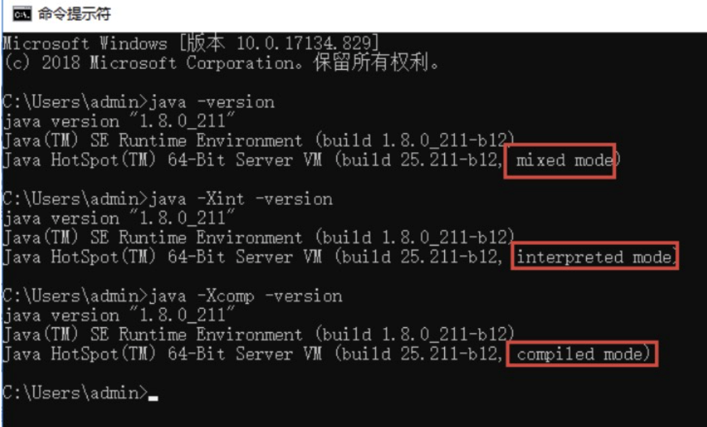

# 050-即时编译

[TOC]

## 即时编译

初始化完成后，类在调用执行过程中，执行引擎会把字节码转为机器码，然后在操作系统中才能执行。在字节码转换为机器码的过程中，虚拟机中还存在着一道编译，那就是即时编译。

最初，虚拟机中的字节码是由解释器（ Interpreter ）完成编译的，当虚拟机发现某个方法或代码块的运行特别频繁的时候，就会把这些代码认定为“热点代码”。

为了提高热点代码的执行效率，在运行时，即时编译器（JIT）会把这些代码编译成与本地平台相关的机器码，并进行各层次的优化，然后保存到内存中。

### 即时编译器类型

在 HotSpot 虚拟机中，内置了两个 JIT，分别为 C1 编译器和 C2 编译器，这两个编译器的编译过程是不一样的。

C1 编译器是一个简单快速的编译器，主要的关注点在于局部性的优化，适用于执行时间较短或对启动性能有要求的程序，例如，GUI 应用对界面启动速度就有一定要求。

C2 编译器是为长期运行的服务器端应用程序做性能调优的编译器，适用于执行时间较长或对峰值性能有要求的程序。根据各自的适配性

这两种即时编译也被称为 Client Compiler 和 Server Compiler。

在 Java7 之前，需要根据程序的特性来选择对应的 JIT，虚拟机默认采用解释器和其中一个编译器配合工作。

Java7 引入了分层编译，这种方式综合了 C1 的启动性能优势和 C2 的峰值性能优势，我们也可以通过参数 “-client”“-server” 强制指定虚拟机的即时编译模式。**分层编译将 JVM 的执行状态分为了 5 个层次：**

- 第 0 层：程序解释执行，默认开启性能监控功能（Profiling），如果不开启，可触发第二层编译；
- 第 1 层：可称为 C1 编译，将字节码编译为本地代码，进行简单、可靠的优化，不开启 Profiling；
- 第 2 层：也称为 C1 编译，开启 Profiling，仅执行带方法调用次数和循环回边执行次数 profiling 的 C1 编译；
- 第 3 层：也称为 C1 编译，执行所有带 Profiling 的 C1 编译；
- 第 4 层：可称为 C2 编译，也是将字节码编译为本地代码，但是会启用一些编译耗时较长的优化，甚至会根据性能监控信息进行一些不可靠的激进优化。

在 Java8 中，默认开启分层编译，-client 和 -server 的设置已经是无效的了。

如果只想开启 C2，可以关闭分层编译（-XX:-TieredCompilation），如果只想用 C1，可以在打开分层编译的同时，使用参数：-XX:TieredStopAtLevel=1。

除了这种默认的混合编译模式，我们还可以使用“-Xint”参数强制虚拟机运行于只有解释器的编译模式下，这时 JIT 完全不介入工作；我们还可以使用参数“-Xcomp”强制虚拟机运行于只有 JIT 的编译模式下。

通过 java -version 命令行可以直接查看到当前系统使用的编译模式。如下图所示：

