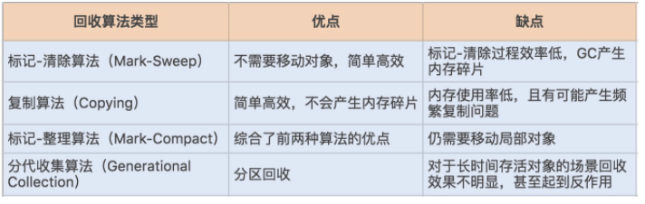
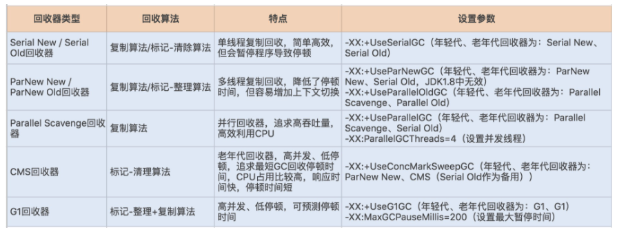

# 020-GC算法

[TOC]


## 常见的垃圾收集算法

JVM 提供了不同的回收算法来实现这一套回收机制，通常垃圾收集器的回收算法可以分为以下几种：



## 常见的垃圾收集器

如果说收集算法是内存回收的方法论，那么垃圾收集器就是内存回收的具体实现，JDK1.7 update14 之后 Hotspot 虚拟机所有的回收器整理如下（以下为服务端垃圾收集器）：



```
//Serial New /Serial Old
-XX:+UseSerialGC
```

```
//ParNew New / ParNew Old
-XX:+UseParNewGC			// 年轻代(ParNew)  老年代(Serial Old)
-XX:+UseParallelOldGC // 年轻代(Parallel Scanvenge)老年代(Parallel Old)
```

```
//Parallel Scanvenge
-XX:+UseParallelGC //年轻代(Parallel Scavenage, 老年代Serial Old)
-XX:ParallelGCThreads=4 //设置并发线程
```

```
//CMS
-XX:UseConcMarkSweepGC
年轻代=ParNew new
老年代=CMS
```

```
//G1
-XX:+UseG1GC
-XX:MaxGCPauseMillis = 200 设置最大暂停时间
年轻代:G1
老年代:G1
```

##  jmap查看垃圾收集器情况

其实在 JVM 规范中并没有明确 GC 的运作方式，各个厂商可以采用不同的方式实现垃圾收集器。我们可以通过 JVM 工具查询当前 JVM 使用的垃圾收集器类型，首先通过 ps 命令查询出进程 ID，再通过 jmap -heap ID 查询出 JVM 的配置信息，其中就包括垃圾收集器的设置类型。

```
[root@192-168-16-140 ~]# jmap -heap 102620
Attaching to process ID 102620, please wait...
Debugger attached successfully.
Server compiler detected.
JVM version is 25.261-b12

using thread-local object allocation.
Parallel GC with 8 thread(s)

Heap Configuration:
   MinHeapFreeRatio         = 40
   MaxHeapFreeRatio         = 70
   MaxHeapSize              = 4294967296 (4096.0MB)
   NewSize                  = 4294443008 (4095.5MB)
   MaxNewSize               = 4294443008 (4095.5MB)
   OldSize                  = 524288 (0.5MB)
   NewRatio                 = 2
   SurvivorRatio            = 10
   MetaspaceSize            = 134217728 (128.0MB)
   CompressedClassSpaceSize = 260046848 (248.0MB)
   MaxMetaspaceSize         = 268435456 (256.0MB)
   G1HeapRegionSize         = 0 (0.0MB)

Heap Usage:
PS Young Generation
Eden Space:
   capacity = 3579314176 (3413.5MB)
   used     = 3262333704 (3111.2038650512695MB)
   free     = 316980472 (302.29613494873047MB)
   91.14410033839958% used
From Space:
   capacity = 357564416 (341.0MB)
   used     = 0 (0.0MB)
   free     = 357564416 (341.0MB)
   0.0% used
To Space:
   capacity = 357564416 (341.0MB)
   used     = 0 (0.0MB)
   free     = 357564416 (341.0MB)
   0.0% used
PS Old Generation
   capacity = 524288 (0.5MB)
   used     = 518480 (0.4944610595703125MB)
   free     = 5808 (0.0055389404296875MB)
   98.8922119140625% used
```


