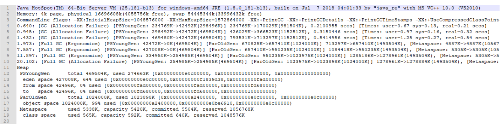
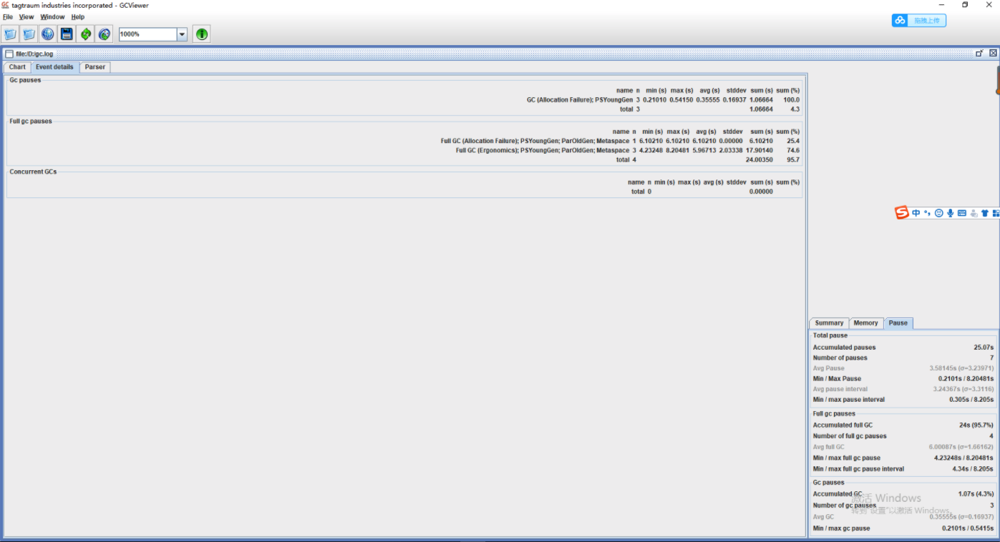
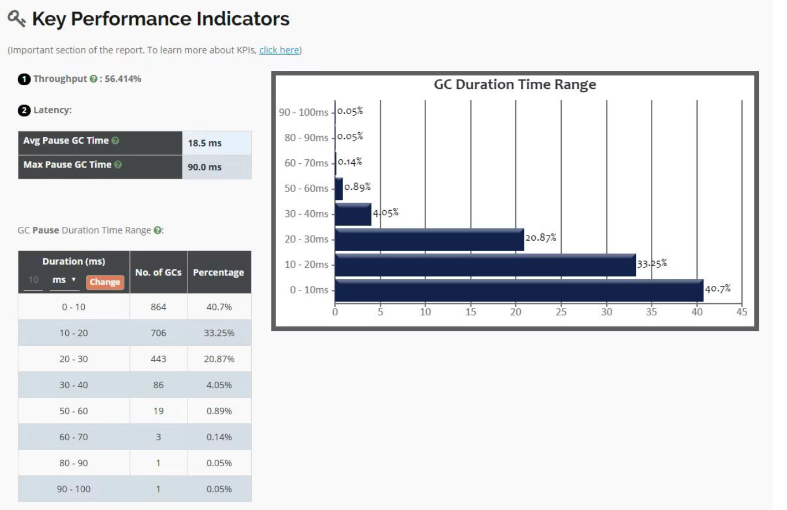
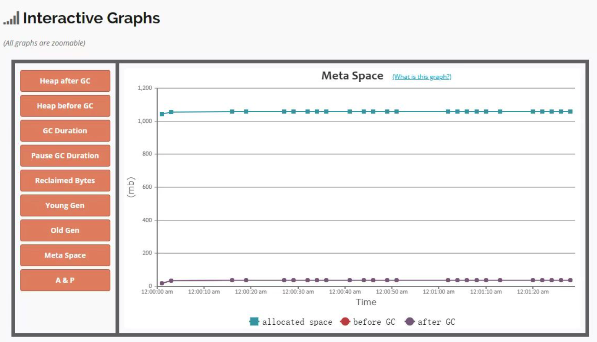

# 040-查看&分析GC日志.md

已知了性能衡量指标，现在我们需要通过工具查询 GC 相关日志，统计各项指标的信息。首先，我们需要通过 JVM 参数预先设置 GC 日志，通常有以下几种 JVM 参数设置：

```
-XX:+PrintGC 输出 GC 日志
-XX:+PrintGCDetails 输出 GC 的详细日志
-XX:+PrintGCTimeStamps 输出 GC 的时间戳（以基准时间的形式）
-XX:+PrintGCDateStamps 输出 GC 的时间戳（以日期的形式，如 2013-05-04T21:53:59.234+0800）
-XX:+PrintHeapAtGC 在进行 GC 的前后打印出堆的信息
-Xloggc:../logs/gc.log 日志文件的输出路径
```

这里使用如下参数来打印日志：

```
-XX:+PrintGCDateStamps -XX:+PrintGCDetails -Xloggc:./gclogs
```

打印后的日志为：



上图是运行很短时间的 GC 日志，如果是长时间的 GC 日志，我们很难通过文本形式去查看整体的 GC 性能。此时，我们可以通过[GCView](https://sourceforge.net/projects/gcviewer/)工具打开日志文件，图形化界面查看整体的 GC 性能，如下图所示：




通过工具，我们可以看到吞吐量、停顿时间以及 GC 的频率，从而可以非常直观地了解到 GC 的性能情况。

这里我再推荐一个比较好用的 GC 日志分析工具，[GCeasy](https://www.gceasy.io/index.jsp)是一款非常直观的 GC 日志分析工具，我们可以将日志文件压缩之后，上传到 GCeasy 官网即可看到非常清楚的 GC 日志分析结果：






