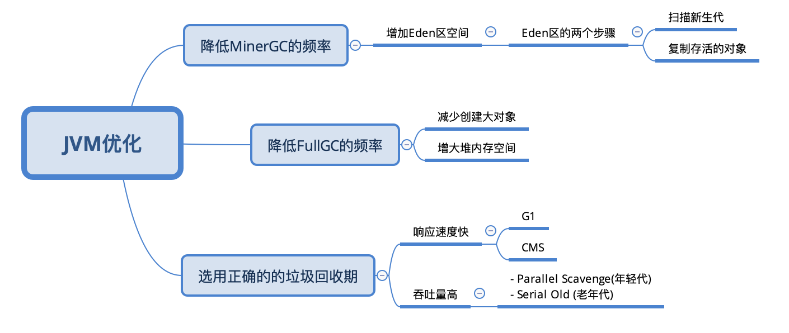

# 050-GC调优策略.md

[TOC]

找出问题后，就可以进行调优了，下面介绍几种常用的 GC 调优策略。

### 1. 降低MinorGC频率

通常情况下，由于新生代空间较小，Eden 区很快被填满，就会导致频繁 Minor GC，因此我们可以通过增大新生代空间来降低 Minor GC 的频率。

可能你会有这样的疑问，扩容 Eden 区虽然可以减少 Minor GC 的次数，但不会增加单次 Minor GC 的时间吗？如果单次 Minor GC 的时间增加，那也很难达到我们期待的优化效果呀。

我们知道，单次 Minor GC 时间是由两部分组成：

- T1（扫描新生代）
- T2（复制存活对象）

假设一个对象在 Eden 区的存活时间为 500ms，Minor GC 的时间间隔是 300ms，那么正常情况下，Minor GC 的时间为 ：T1+T2。

当我们增大新生代空间，Minor GC 的时间间隔可能会扩大到 600ms，此时一个存活 500ms 的对象就会在 Eden 区中被回收掉，此时就不存在复制存活对象了，所以再发生 Minor GC 的时间为：两次扫描新生代，即 2T1。

可见，扩容后，Minor GC 时增加了 T1，但省去了 T2 的时间。通常在虚拟机中，复制对象的成本要远高于扫描成本。

- 如果在堆内存中存在较多的长期存活的对象，此时增加年轻代空间，反而会增加 Minor GC 的时间。

- 如果堆中的短期对象很多，那么扩容新生代，单次 Minor GC 时间不会显著增加。

因此，单次 Minor GC 时间更多取决于 GC 后存活对象的数量，而非 Eden 区的大小。

### 2. 降低 Full GC 的频率

通常情况下，由于堆内存空间不足或老年代对象太多，会触发 Full GC，频繁的 Full GC 会带来上下文切换，增加系统的性能开销。我们可以使用哪些方法来降低 Full GC 的频率呢？

**减少创建大对象：**在平常的业务场景中，我们习惯一次性从数据库中查询出一个大对象用于 web 端显示。

例如，我之前碰到过一个一次性查询出 60 个字段的业务操作，这种大对象如果超过年轻代最大对象阈值，会被直接创建在老年代；

- 即使被创建在了年轻代，由于年轻代的内存空间有限，通过 Minor GC 之后也会进入到老年代。这种大对象很容易产生较多的 Full GC。

我们可以将这种大对象拆解出来，首次只查询一些比较重要的字段，如果还需要其它字段辅助查看，再通过第二次查询显示剩余的字段。

**增大堆内存空间：**在堆内存不足的情况下，增大堆内存空间，且设置初始化堆内存为最大堆内存，也可以降低 Full GC 的频率。

### 选择合适的 GC 回收器

假设我们有这样一个需求，要求每次操作的响应时间必须在 500ms 以内。这个时候我们一般会选择响应速度较快的 GC 回收器，CMS（Concurrent Mark Sweep）回收器和 G1 回收器都是不错的选择。

而当我们的需求对系统吞吐量有要求时，就可以选择 Parallel Scavenge 回收器来提高系统的吞吐量。

## 总结

今天的内容比较多，最后再强调几个重点。

垃圾收集器的种类很多，我们可以将其分成两种类型，

- 一种是响应速度快
- 一种是吞吐量高。

通常情况下，CMS 和 G1 回收器的响应速度快，Parallel Scavenge 回收器的吞吐量高。

在 JDK1.8 环境下，默认使用的是 Parallel Scavenge（年轻代）+Serial Old（老年代）垃圾收集器，你可以通过文中介绍的查询 JVM 的 GC 默认配置方法进行查看。

通常情况，JVM 是默认垃圾回收优化的，在没有性能衡量标准的前提下，尽量避免修改 GC 的一些性能配置参数。如果一定要改，那就必须基于大量的测试结果或线上的具体性能来进行调整。

