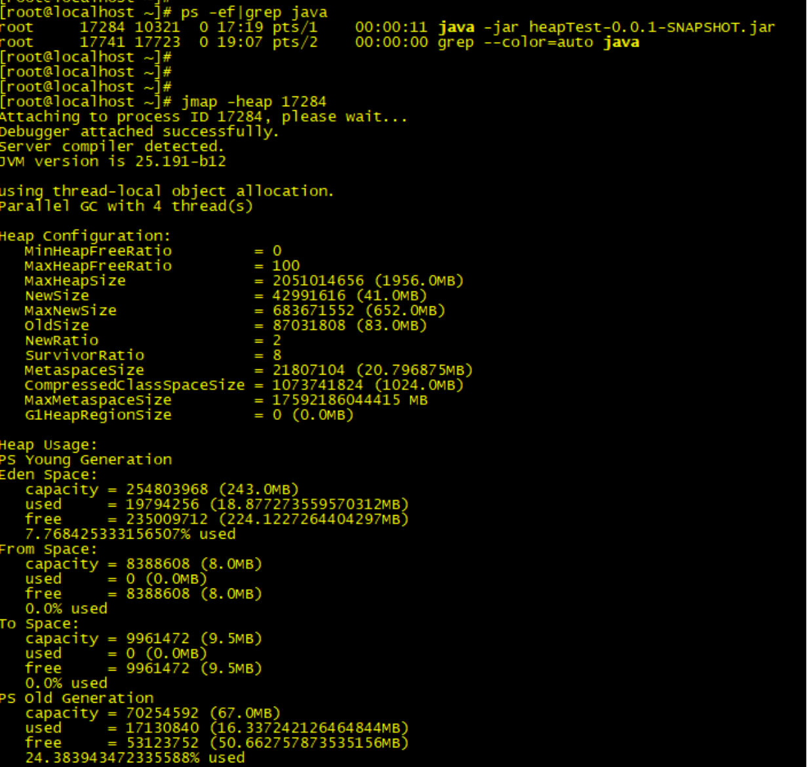

# 020-查看堆内存的分配

[TOC]

我们知道了一个对象从创建至回收到堆中的过程，接下来我们再来了解下 JVM 堆内存是如何分配的。在默认不配置 JVM 堆内存大小的情况下，JVM 根据默认值来配置当前内存大小。我们可以通过以下命令来查看堆内存配置的默认值：

```java
java -XX:+PrintFlagsFinal -version | grep HeapSize 
jmap -heap 17284
```

## PrintFlagsFinal

```
[root@node1 ~]# java -XX:+PrintFlagsFinal -version | grep HeapSize
    uintx ErgoHeapSizeLimit                         = 0                                   {product}
    uintx HeapSizePerGCThread                       = 87241520                            {product}
    uintx InitialHeapSize                          := 1061158912                          {product}
    uintx LargePageHeapSizeThreshold                = 134217728                           {product}
    uintx MaxHeapSize                              := 16978542592                         {product}
java version "1.8.0_171"
Java(TM) SE Runtime Environment (build 1.8.0_171-b11)
Java HotSpot(TM) 64-Bit Server VM (build 25.171-b11, mixed mode)
```

## jmap -heap 22755

```
[root@node1 ~]# jmap -heap 22755
Attaching to process ID 22755, please wait...
Debugger attached successfully.
Server compiler detected.
JVM version is 25.171-b11

using thread-local object allocation.
Parallel GC with 8 thread(s)

Heap Configuration:
   MinHeapFreeRatio         = 40	//空闲堆空间的最小百分比
   MaxHeapFreeRatio         = 70	//空闲堆空间的最大百分比
   MaxHeapSize              = 4294967296 (4096.0MB)  //默认最大堆内存
   NewSize                  = 4294443008 (4095.5MB)//新生代堆空间的默认值
   MaxNewSize               = 4294443008 (4095.5MB)//新生代堆空间允许的最大值
   OldSize                  = 524288 (0.5MB)//老年代堆空间的默认值
   NewRatio = 2//新生代（2个Survivor区和Eden区 ）与老年代（不包括永久区）的堆空间比值，表示新生代：老年代=1：2。
   SurvivorRatio            = 10 //两个Survivor区和Eden区的堆空间比值
   MetaspaceSize            = 134217728 (128.0MB) //元空间的默认值
   CompressedClassSpaceSize = 260046848 (248.0MB)
   MaxMetaspaceSize         = 268435456 (256.0MB)
   G1HeapRegionSize         = 0 (0.0MB)

Heap Usage:
PS Young Generation
Eden Space:
   capacity = 3579314176 (3413.5MB)
   used     = 249224040 (237.6785659790039MB)
   free     = 3330090136 (3175.821434020996MB)
   6.9628992523510735% used
From Space:
   capacity = 357564416 (341.0MB)
   used     = 0 (0.0MB)
   free     = 357564416 (341.0MB)
   0.0% used
To Space:
   capacity = 357564416 (341.0MB)
   used     = 0 (0.0MB)
   free     = 357564416 (341.0MB)
   0.0% used
PS Old Generation
   capacity = 524288 (0.5MB)
   used     = 517936 (0.4939422607421875MB)
   free     = 6352 (0.0060577392578125MB)
   98.7884521484375% used

14441 interned Strings occupying 1347608 bytes.
```

通过命令，我们可以获得在这台机器上启动的 JVM 默认最大堆内存为 4096MB，初始化大小为 124MB。




通过命令，我们可以获得在这台机器上启动的 JVM 默认最大堆内存为 1953MB，初始化大小为 124MB。

在 JDK1.7 中，默认情况下年轻代和老年代的比例是 1:2，我们可以通过–XX:NewRatio 重置该配置项。

年轻代中的 Eden 和 To Survivor、From Survivor 的比例是 8:1:1，我们可以通过 -XX:SurvivorRatio 重置该配置项。

在 JDK1.7 中如果开启了 -XX:+UseAdaptiveSizePolicy 配置项，JVM 将会动态调整 Java 堆中各个区域的大小以及进入老年代的年龄，

- –XX:NewRatio 和 -XX:SurvivorRatio 将会失效，而 JDK1.8 是默认开启 -XX:+UseAdaptiveSizePolicy 配置项的。

还有，在 JDK1.8 中，不要随便关闭 UseAdaptiveSizePolicy 配置项，除非你已经对初始化堆内存 / 最大堆内存、年轻代 / 老年代以及 Eden 区 /Survivor 区有非常明确的规划了。否则 JVM 将会分配最小堆内存，年轻代和老年代按照默认比例 1:2 进行分配，年轻代中的 Eden 和 Survivor 则按照默认比例 8:2 进行分配。

这个内存分配未必是应用服务的最佳配置，因此可能会给应用服务带来严重的性能问题。

## 参数

| MinHeapFreeRatio | 空闲堆空间的最小百分比，计算公式为：HeapFreeRatio =(CurrentFreeHeapSize/CurrentTotalHeapSize) * 100，值的区间为0到100，默认值为 40。如果HeapFreeRatio < MinHeapFreeRatio，则需要进行堆扩容，扩容的时机应该在每次垃圾回收之后。 |
| ---------------- | ------------------------------------------------------------ |
| MaxHeapFreeRatio | 空闲堆空间的最大百分比，计算公式为：HeapFreeRatio =(CurrentFreeHeapSize/CurrentTotalHeapSize) * 100，值的区间为0到100，默认值为 70。如果HeapFreeRatio > MaxHeapFreeRatio，则需要进行堆缩容，缩容的时机应该在每次垃圾回收之后。<br/> |
| MaxHeapSize      | JVM 堆空间允许的最大值                                       |
| NewSize          | JVM 新生代堆空间的默认值                                     |
| MaxNewSize       | JVM 新生代堆空间允许的最大值                                 |
| OldSize          | JVM 老年代堆空间的默认值                                     |
| NewRatio         | 新生代（2个Survivor区和Eden区 ）与老年代（不包括永久区）的堆空间比值，表示新生代：老年代=1：2。 |
| SurvivorRatio    | 两个Survivor区和Eden区的堆空间比值为 8，表示 S0 ： S1 ：Eden = 1：1：8 |
| MetaspaceSize    | JVM 元空间的默认值。                                         |
| MaxMetaspaceSize | JVM 元空间允许的最大值。                                     |
| G1HeapRegionSize | 在使用 G1 垃圾回收算法时，JVM 会将 Heap 空间分隔为若干个 Region，该参数用来指定每个 Region 空间的大小。 |
|                  |                                                              |

