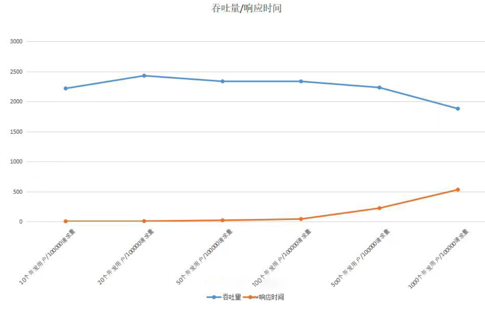
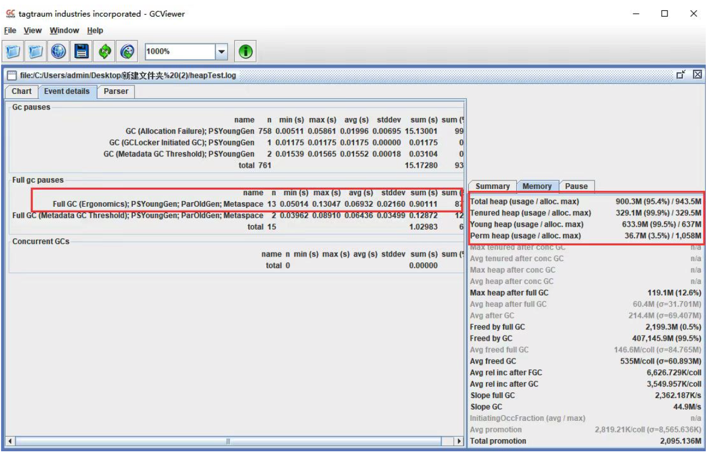
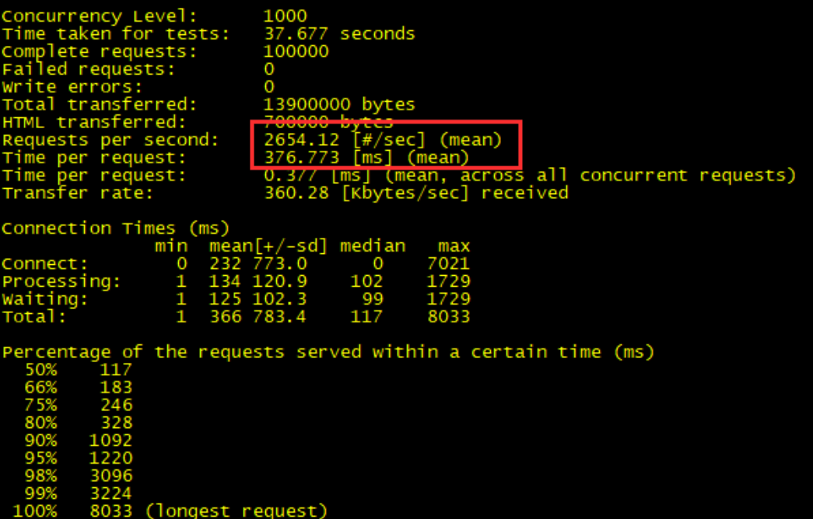
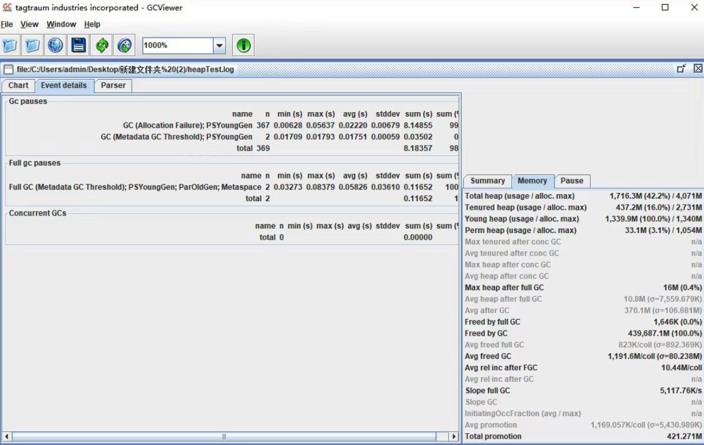
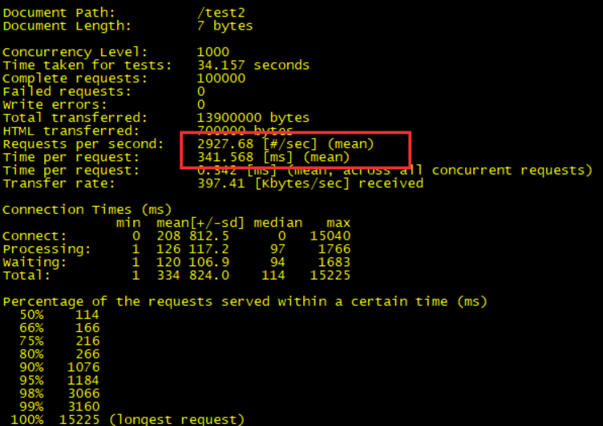
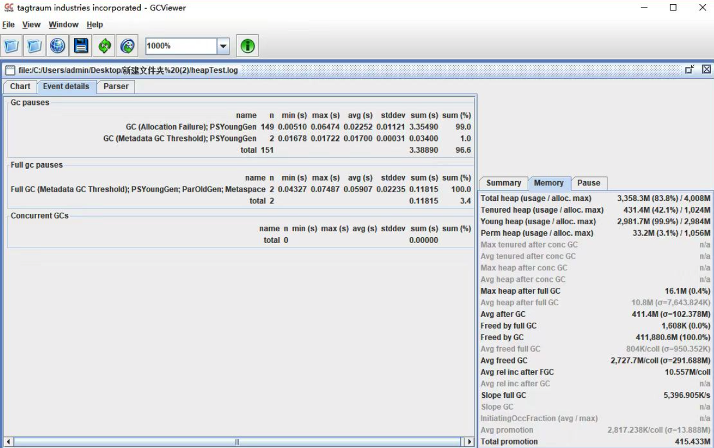
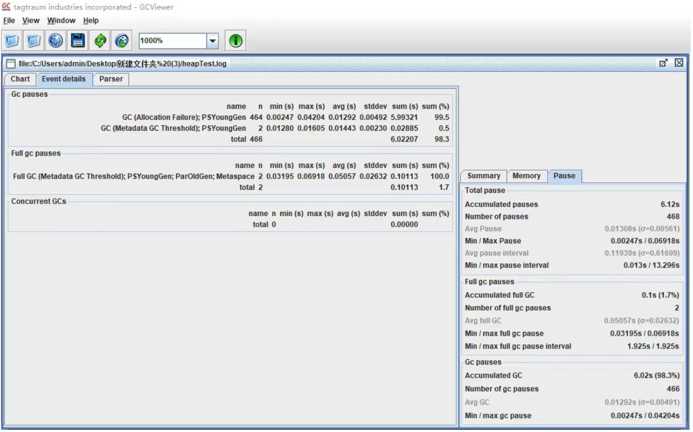

# 030-JVM内存分配的调优过程

[TOC]

## 准备实例

我们先使用 JVM 的默认配置，观察应用服务的运行情况，下面我将结合一个实际案例来讲述。现模拟一个抢购接口，假设需要满足一个 5W 的并发请求，且每次请求会产生 20KB 对象，我们可以通过千级并发创建一个 1MB 对象的接口来模拟万级并发请求产生大量对象的场景，具体代码如下：

```java
@RequestMapping(value = "/test1")
public String test1(HttpServletRequest request) {
  List<Byte[]> temp = new ArrayList<Byte[]>();

  Byte[] b = new Byte[1024*1024];
  temp.add(b);

  return "success";
}
```

### AB 压测

分别对应用服务进行压力测试，以下是请求接口的吞吐量和响应时间在不同并发用户数下的变化情况：



可以看到，当并发数量到了一定值时，吞吐量就上不去了，响应时间也迅速增加。那么，在 JVM 内部运行又是怎样的呢？

### 分析 GC 日志

此时我们可以通过 GC 日志查看具体的回收日志。我们可以通过设置 VM 配置参数，将运行期间的 GC 日志 dump 下来，具体配置参数如下：

```
 -XX:+PrintGCTimeStamps -XX:+PrintGCDetails -Xloggc:/log/heapTest.log
```

以下是各个配置项的说明：

- -XX:PrintGCTimeStamps：打印 GC 具体时间；
- -XX:PrintGCDetails ：打印出 GC 详细日志；
- -Xloggc: path：GC 日志生成路径。

收集到 GC 日志后，我们就可以使用[第 22 讲](https://time.geekbang.org/column/article/107396)中介绍过的 GCViewer 工具打开它，进而查看到具体的 GC 日志如下：



主页面显示 FullGC 发生了 13 次，右下角显示年轻代和老年代的内存使用率几乎达到了 100%。而 FullGC 会导致 stop-the-world 的发生，从而严重影响到应用服务的性能。此时，我们需要调整堆内存的大小来减少 FullGC 的发生。

### 参考指标

我们可以将某些指标的预期值作为参考指标，上面的 GC 频率就是其中之一，那么还有哪些指标可以为我们提供一些具体的调优方向呢？

**GC 频率：**高频的 FullGC 会给系统带来非常大的性能消耗，虽然 MinorGC 相对 FullGC 来说好了许多，但过多的 MinorGC 仍会给系统带来压力。

**内存：**这里的内存指的是堆内存大小，堆内存又分为年轻代内存和老年代内存。首先我们要分析堆内存大小是否合适，其实是分析年轻代和老年代的比例是否合适。如果内存不足或分配不均匀，会增加 FullGC，严重的将导致 CPU 持续爆满，影响系统性能。

**吞吐量：**频繁的 FullGC 将会引起线程的上下文切换，增加系统的性能开销，从而影响每次处理的线程请求，最终导致系统的吞吐量下降。

**延时：**JVM 的 GC 持续时间也会影响到每次请求的响应时间。

### 具体调优方法

**调整堆内存空间减少 FullGC：**通过日志分析，堆内存基本被用完了，而且存在大量 FullGC，这意味着我们的堆内存严重不足，这个时候我们需要调大堆内存空间。

```java
java -jar -Xms4g -Xmx4g heapTest-0.0.1-SNAPSHOT.jar
```

以下是各个配置项的说明：

- -Xms：堆初始大小；
- -Xmx：堆最大值。

调大堆内存之后，我们再来测试下性能情况，发现吞吐量提高了 40% 左右，响应时间也降低了将近 50%。



再查看 GC 日志，发现 FullGC 频率降低了，老年代的使用率只有 16% 了。



**调整年轻代减少 MinorGC：**通过调整堆内存大小，我们已经提升了整体的吞吐量，降低了响应时间。那还有优化空间吗？我们还可以将年轻代设置得大一些，从而减少一些 MinorGC（[第 22 讲](https://time.geekbang.org/column/article/107396)有通过降低 Minor GC 频率来提高系统性能的详解）。

```java
java -jar -Xms4g -Xmx4g -Xmn3g heapTest-0.0.1-SNAPSHOT.jar
```

再进行 AB 压测，发现吞吐量上去了。



再查看 GC 日志，发现 MinorGC 也明显降低了，GC 花费的总时间也减少了。



**设置 Eden、Survivor 区比例：**在 JVM 中，如果开启 AdaptiveSizePolicy，则每次 GC 后都会重新计算 Eden、From Survivor 和 To Survivor 区的大小，计算依据是 GC 过程中统计的 GC 时间、吞吐量、内存占用量。这个时候 SurvivorRatio 默认设置的比例会失效。

在 JDK1.8 中，默认是开启 AdaptiveSizePolicy 的，我们可以通过 -XX:-UseAdaptiveSizePolicy 关闭该项配置，或显示运行 -XX:SurvivorRatio=8 将 Eden、Survivor 的比例设置为 8:2。大部分新对象都是在 Eden 区创建的，我们可以固定 Eden 区的占用比例，来调优 JVM 的内存分配性能。

再进行 AB 性能测试，我们可以看到吞吐量提升了，响应时间降低了。




## 总结

JVM 内存调优通常和 GC 调优是互补的，基于以上调优，我们可以继续对年轻代和堆内存的垃圾回收算法进行调优。这里可以结合上一讲的内容，一起完成 JVM 调优。

虽然分享了一些 JVM 内存分配调优的常用方法，但我还是建议你在进行性能压测后如果没有发现突出的性能瓶颈，就继续使用 JVM 默认参数，起码在大部分的场景下，默认配置已经可以满足我们的需求了。但满足不了也不要慌张，结合今天所学的内容去实践一下，相信你会有新的收获。

## 思考题

以上我们都是基于堆内存分配来优化系统性能的，但在 NIO 的 Socket 通信中，其实还使用到了堆外内存来减少内存拷贝，实现 Socket 通信优化。你知道堆外内存是如何创建和回收的吗？