# 010-常用的监控和诊断内存工具

[TOC]

工欲善其事，必先利其器。平时排查内存性能瓶颈时，我们往往需要用到一些 Linux 命令行或者 JDK 工具来辅助我们监测系统或者虚拟机内存的使用情况，下面我就来介绍几种好用且常用的工具。

## Linux命令行工具之top命令

top 命令是我们在 Linux 下最常用的命令之一，它可以实时显示正在执行进程的 CPU 使用率、内存使用率以及系统负载等信息。其中上半部分显示的是系统的统计信息，下半部分显示的是进程的使用率统计信息。

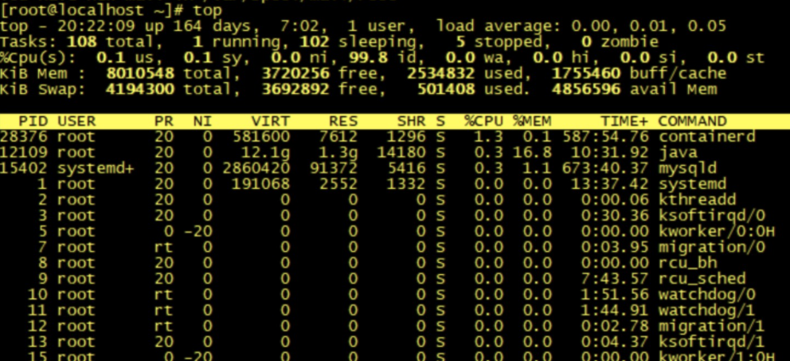

除了简单的 top 之外，我们还可以通过 top -Hp pid 查看具体线程使用系统资源情况：

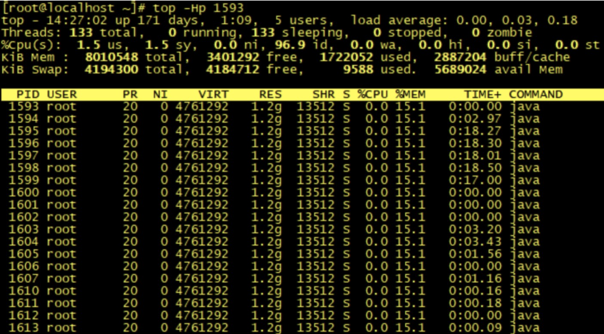

## Linux命令行工具之vmstat命令

vmstat 是一款指定采样周期和次数的功能性监测工具，我们可以看到，它不仅可以统计内存的使用情况，还可以观测到 CPU 的使用率、swap 的使用情况。

但 vmstat 一般很少用来查看内存的使用情况，而是经常被用来观察进程的上下文切换。

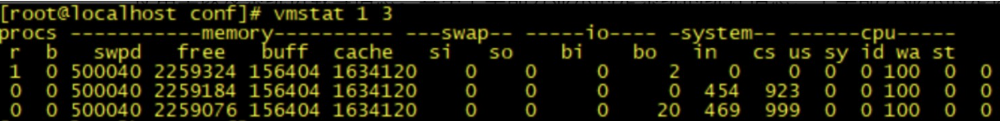

- r：等待运行的进程数；
- b：处于非中断睡眠状态的进程数；
- swpd：虚拟内存使用情况；
- free：空闲的内存；
- buff：用来作为缓冲的内存数；
- si：从磁盘交换到内存的交换页数量；
- so：从内存交换到磁盘的交换页数量；
- bi：发送到块设备的块数；
- bo：从块设备接收到的块数；
- in：每秒中断数；
- cs：每秒上下文切换次数；
- us：用户 CPU 使用时间；
- sy：内核 CPU 系统使用时间；
- id：空闲时间；
- wa：等待 I/O 时间；
- st：运行虚拟机窃取的时间。

## Linux命令行工具之pidstat命令

pidstat 是 Sysstat 中的一个组件，也是一款功能强大的性能监测工具，我们可以通过命令：yum install sysstat 安装该监控组件。之前的 top 和 vmstat 两个命令都是监测进程的内存、CPU 以及 I/O 使用情况，而 pidstat 命令则是深入到线程级别。

通过 pidstat -help 命令，我们可以查看到有以下几个常用的参数来监测线程的性能：

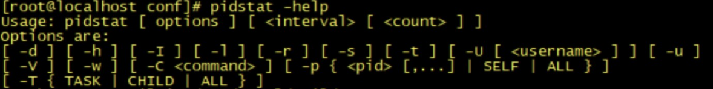

常用参数：

- -u：默认的参数，显示各个进程的 cpu 使用情况；
- -r：显示各个进程的内存使用情况；
- -d：显示各个进程的 I/O 使用情况；
- -w：显示每个进程的上下文切换情况；
- -p：指定进程号；
- -t：显示进程中线程的统计信息。

我们可以通过相关命令（例如 ps 或 jps）查询到相关进程 ID，再运行以下命令来监测该进程的内存使用情况：

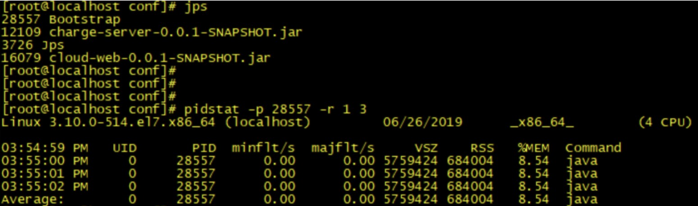

其中 pidstat 的参数 -p 用于指定进程 ID，-r 表示监控内存的使用情况，1 表示每秒的意思，3 则表示采样次数。

其中显示的几个关键指标的含义是：

- Minflt/s：任务每秒发生的次要错误，不需要从磁盘中加载页；
- Majflt/s：任务每秒发生的主要错误，需要从磁盘中加载页；
- VSZ：虚拟地址大小，虚拟内存使用 KB；
- RSS：常驻集合大小，非交换区内存使用 KB。

如果我们需要继续查看该进程下的线程内存使用率，则在后面添加 -t 指令即可：

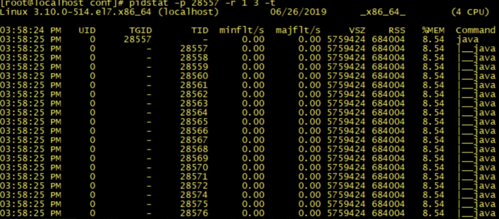

我们知道，Java 是基于 JVM 上运行的，大部分内存都是在 JVM 的用户内存中创建的，所以除了通过以上 Linux 命令来监控整个服务器内存的使用情况之外，我们更需要知道 JVM 中的内存使用情况。JDK 中就自带了很多命令工具可以监测到 JVM 的内存分配以及使用情况。

## JDK 工具之 jstat 命令

jstat 可以监测 Java 应用程序的实时运行情况，包括堆内存信息以及垃圾回收信息。我们可以运行 jstat -help 查看一些关键参数信息：

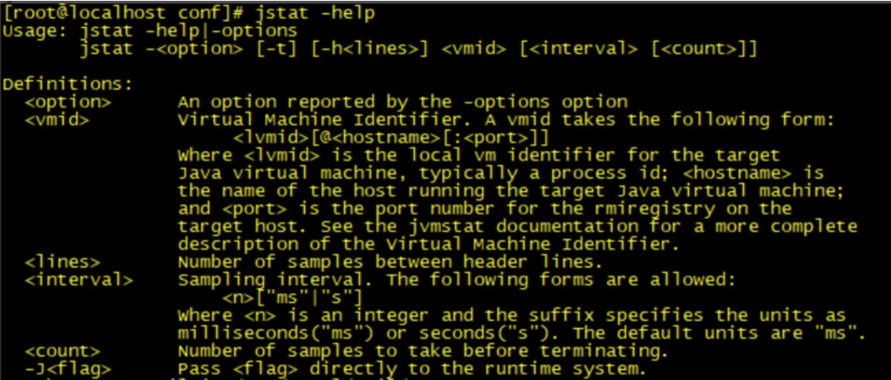

再通过 jstat -option 查看 jstat 有哪些操作：

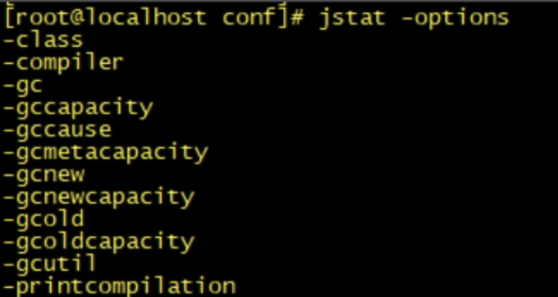

- -class：显示 ClassLoad 的相关信息；
- -compiler：显示 JIT 编译的相关信息；
- -gc：显示和 gc 相关的堆信息；
- -gccapacity：显示各个代的容量以及使用情况；
- -gcmetacapacity：显示 Metaspace 的大小；
- -gcnew：显示新生代信息；
- -gcnewcapacity：显示新生代大小和使用情况；
- -gcold：显示老年代和永久代的信息；
- -gcoldcapacity ：显示老年代的大小；
- -gcutil：显示垃圾收集信息；
- -gccause：显示垃圾回收的相关信息（通 -gcutil），同时显示最后一次或当前正在发生的垃圾回收的诱因；
- -printcompilation：输出 JIT 编译的方法信息。

它的功能比较多，在这里我例举一个常用功能，如何使用 jstat 查看堆内存的使用情况。我们可以用 jstat -gc pid 查看：

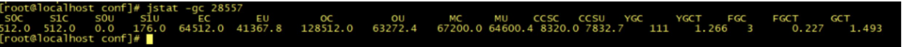

- S0C：年轻代中 To Survivor 的容量（单位 KB）；
- S1C：年轻代中 From Survivor 的容量（单位 KB）；
- S0U：年轻代中 To Survivor 目前已使用空间（单位 KB）；
- S1U：年轻代中 From Survivor 目前已使用空间（单位 KB）；
- EC：年轻代中 Eden 的容量（单位 KB）；
- EU：年轻代中 Eden 目前已使用空间（单位 KB）；
- OC：Old 代的容量（单位 KB）；
- OU：Old 代目前已使用空间（单位 KB）；
- MC：Metaspace 的容量（单位 KB）；
- MU：Metaspace 目前已使用空间（单位 KB）；
- YGC：从应用程序启动到采样时年轻代中 gc 次数；
- YGCT：从应用程序启动到采样时年轻代中 gc 所用时间 (s)；
- FGC：从应用程序启动到采样时 old 代（全 gc）gc 次数；
- FGCT：从应用程序启动到采样时 old 代（全 gc）gc 所用时间 (s)；
- GCT：从应用程序启动到采样时 gc 用的总时间 (s)。

## JDK工具之jstack 命令

这个工具在模块三的[答疑课堂](https://time.geekbang.org/column/article/105234)中介绍过，它是一种线程堆栈分析工具，最常用的功能就是使用 jstack pid 命令查看线程的堆栈信息，通常会结合 top -Hp pid 或 pidstat -p pid -t 一起查看具体线程的状态，也经常用来排查一些死锁的异常。

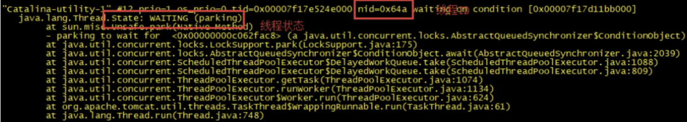

每个线程堆栈的信息中，都可以查看到线程 ID、线程的状态（wait、sleep、running 等状态）以及是否持有锁等。

## JDK工具之jmap命令

在[第 23 讲](https://time.geekbang.org/column/article/108139)中我们使用过 jmap 查看堆内存初始化配置信息以及堆内存的使用情况。那么除了这个功能，我们其实还可以使用 jmap 输出堆内存中的对象信息，包括产生了哪些对象，对象数量多少等。

我们可以用 jmap 来查看堆内存初始化配置信息以及堆内存的使用情况：

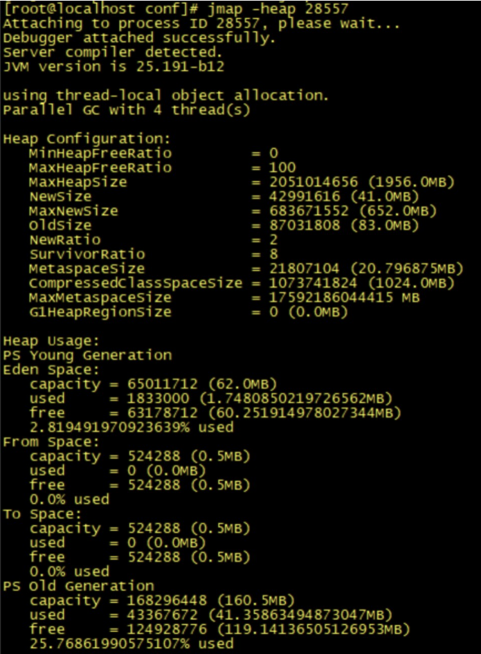

我们可以使用 jmap -histo[:live] pid 查看堆内存中的对象数目、大小统计直方图，如果带上 live 则只统计活对象：

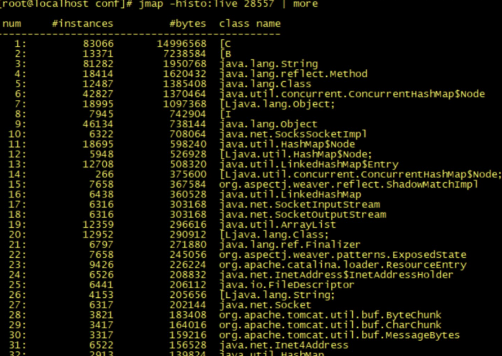

我们可以通过 jmap 命令把堆内存的使用情况 dump 到文件中：

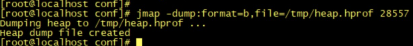

我们可以将文件下载下来，使用 [MAT](http://www.eclipse.org/mat/) 工具打开文件进行分析：