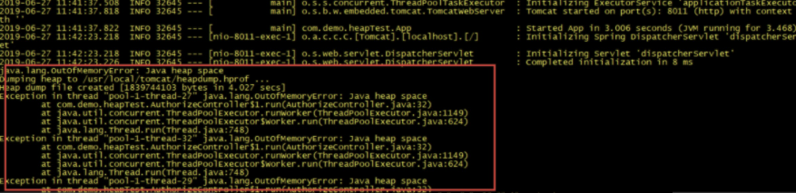
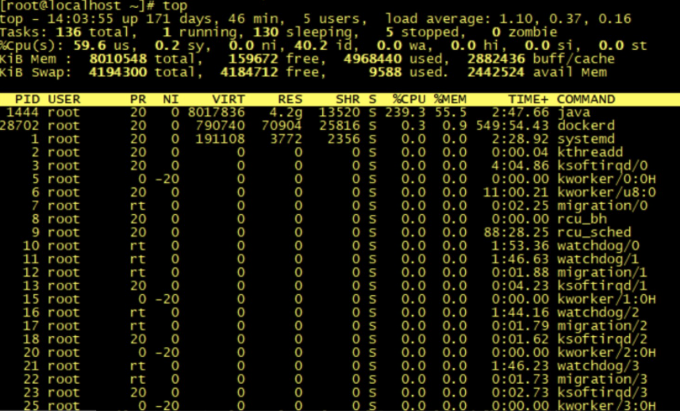
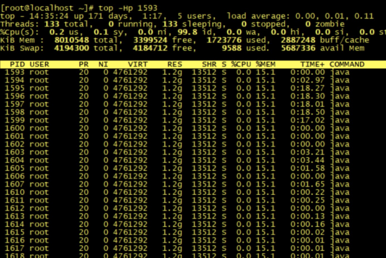
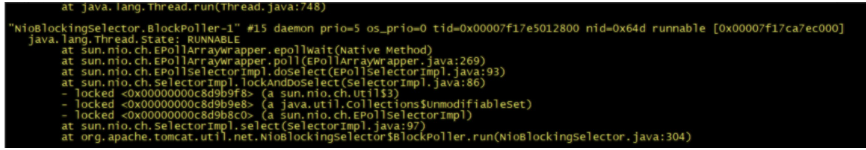
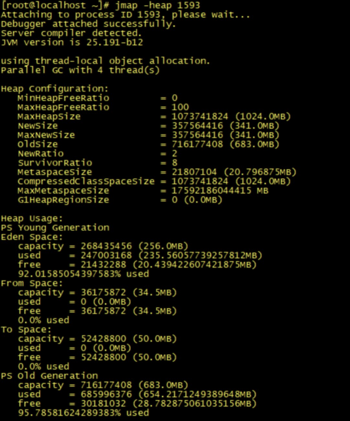
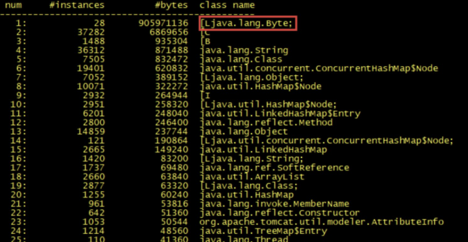
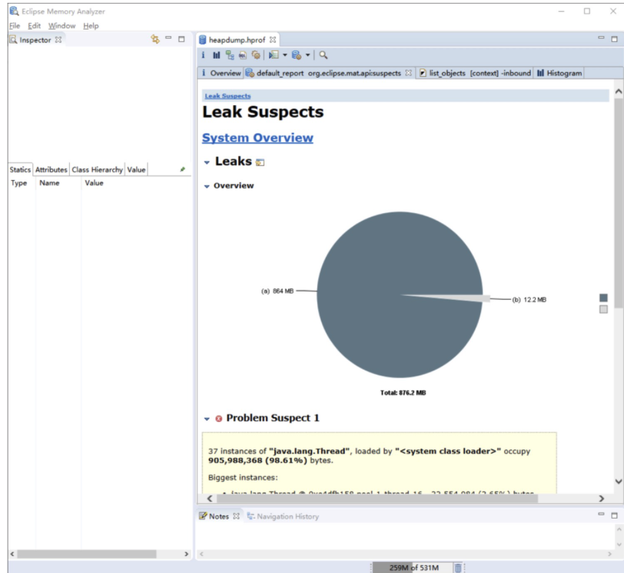
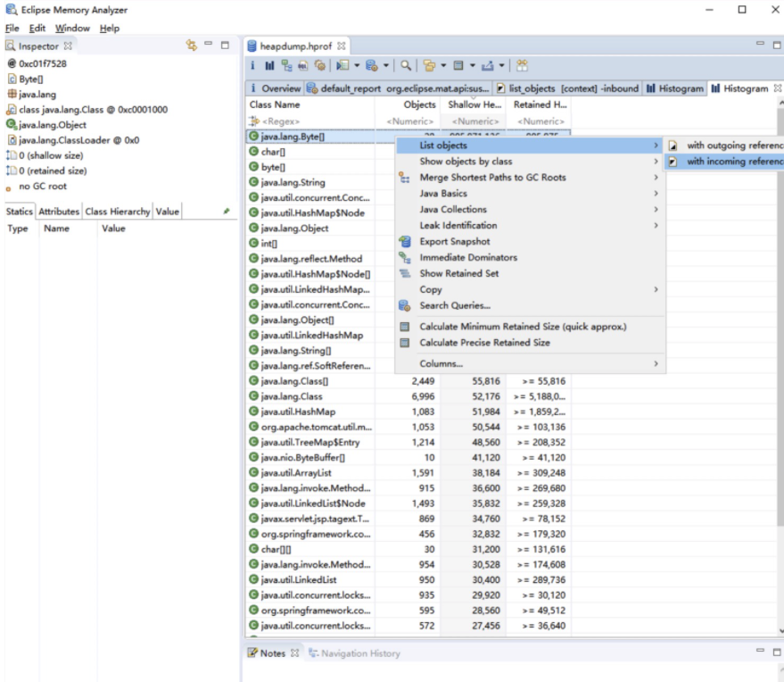
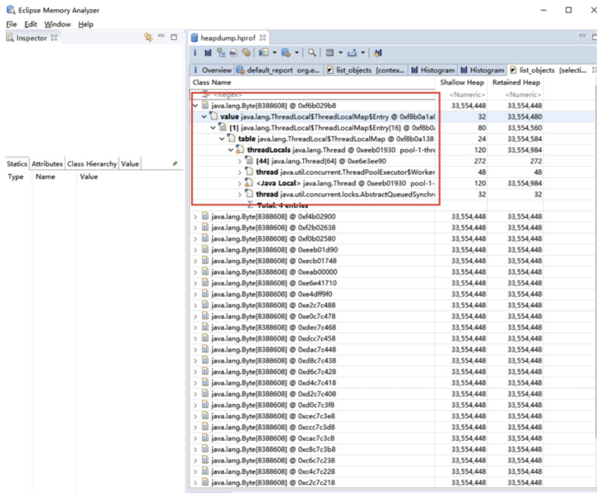

# 020-实战演练

[TOC]

## 内存移除问题分类

我们平时遇到的内存溢出问题一般分为两种，

- 一种是由于大峰值下没有限流，瞬间创建大量对象而导致的内存溢出；
- 另一种则是由于内存泄漏而导致的内存溢出。

使用限流，我们一般就可以解决第一种内存溢出问题，但其实很多时候，内存溢出往往是内存泄漏导致的，这种问题就是程序的 BUG，我们需要及时找到问题代码。

## 模拟内存泄漏导致溢出

**下面我模拟了一个内存泄漏导致的内存溢出案例，我们来实践一下。**

我们知道，ThreadLocal 的作用是提供线程的私有变量，这种变量可以在一个线程的整个生命周期中传递，可以减少一个线程在多个函数或类中创建公共变量来传递信息，避免了复杂度。但在使用时，如果 ThreadLocal 使用不恰当，就可能导致内存泄漏。

这个案例的场景就是 ThreadLocal，下面我们创建 100 个线程。运行以下代码，系统一会儿就发送了内存溢出异常：

```java
final static ThreadPoolExecutor poolExecutor = new ThreadPoolExecutor(100, 100, 1, TimeUnit.MINUTES, new LinkedBlockingQueue<>());// 创建线程池，通过线程池，保证创建的线程存活
final static ThreadLocal<Byte[]> localVariable = new ThreadLocal<Byte[]>();// 声明本地变量

@RequestMapping(value = "/test0")
public String test0(HttpServletRequest request) {
  poolExecutor.execute(new Runnable() {
    public void run() {
      Byte[] c = new Byte[4096*1024];
      localVariable.set(c);// 为线程添加变量

    }
  });
  return "success";
}

@RequestMapping(value = "/test1")
public String test1(HttpServletRequest request) {
  List<Byte[]> temp1 = new ArrayList<Byte[]>();

  Byte[] b = new Byte[1024*20];
  temp1.add(b);// 添加局部变量

  return "success";
}
```

在启动应用程序之前，我们可以通过 HeapDumpOnOutOfMemoryError 和 HeapDumpPath 这两个参数开启堆内存异常日志，通过以下命令启动应用程序：

```
java -jar -Xms1000m -Xmx4000m -XX:+HeapDumpOnOutOfMemoryError -XX:HeapDumpPath=/tmp/heapdump.hprof -Xms1g -Xmx1g -XX:+PrintGCTimeStamps -XX:+PrintGCDetails -Xloggc:/tmp/heapTest.log heapTest-0.0.1-SNAPSHOT.jar
```

首先，请求 test0 链接 10000 次，之后再请求 test1 链接 10000 次，这个时候我们请求 test1 的接口报异常了。



通过日志，我们很好分辨这是一个内存溢出异常。我们首先通过 Linux 系统命令查看进程在整个系统中内存的使用率是多少，最简单就是 top 命令了。



从 top 命令查看进程的内存使用情况，可以发现在机器只有 8G 内存且只分配了 4G 内存给 Java 进程的情况下，Java 进程内存使用率已经达到了 55%，再通过 top -Hp pid 查看具体线程占用系统资源情况。



再通过 jstack pid 查看具体线程的堆栈信息，可以发现该线程一直处于 TIMED_WAITING 状态，此时 CPU 使用率和负载并没有出现异常，我们可以排除死锁或 I/O 阻塞的异常问题了。



我们再通过 jmap 查看堆内存的使用情况，可以发现，老年代的使用率几乎快占满了，而且内存一直得不到释放：



通过以上堆内存的情况，我们基本可以判断系统发生了内存泄漏。下面我们就需要找到具体是什么对象一直无法回收，什么原因导致了内存泄漏。

我们需要查看具体的堆内存对象，看看是哪个对象占用了堆内存，可以通过 jstat 查看存活对象的数量：



Byte 对象占用内存明显异常，说明代码中 Byte 对象存在内存泄漏，我们在启动时，已经设置了 dump 文件，通过 MAT 打开 dump 的内存日志文件，我们可以发现 MAT 已经提示了 byte 内存异常：



再点击进入到 Histogram 页面，可以查看到对象数量排序，我们可以看到 Byte[] 数组排在了第一位，选中对象后右击选择 with incomming reference 功能，可以查看到具体哪个对象引用了这个对象。



在这里我们就可以很明显地查看到是 ThreadLocal 这块的代码出现了问题。



## 总结

在一些比较简单的业务场景下，排查系统性能问题相对来说简单，且容易找到具体原因。但在一些复杂的业务场景下，或是一些开源框架下的源码问题，相对来说就很难排查了，有时候通过工具只能猜测到可能是某些地方出现了问题，而实际排查则要结合源码做具体分析。

可以说没有捷径，排查线上的性能问题本身就不是一件很简单的事情，除了将今天介绍的这些工具融会贯通，还需要我们不断地去累积经验，真正做到性能调优。

## 思考题

除了以上我讲到的那些排查内存性能瓶颈的工具之外，你知道要在代码中对 JVM 的内存进行监控，常用的方法是什么？


