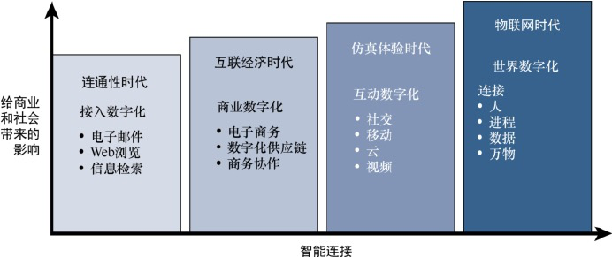

# 010-物联网的起源

[TOC]

## 简介

- "物联网" 一词提出人是 KevinAshton,1999年就职与宝洁公司时提出的新的观点

## 物联网的演化阶段

- 连通性时代(接入数字化) : 在这个阶段, 人们可以通过电子邮件, Web服务和信息检索来轻松的访问信息
- 互联经济时代(商业数字化): 在这个阶段, 除了电子商业和供应链的改善之外, 人们可以通过协作的方式提升商务流程的效率
- 仿真体验时代(互动数字化) : 在这个阶段, 互联网的体验中进一步包含了大量的视频和社交媒体, 而且人民可以通过移动端进行连接, 越来越多的应用迁移到了云端
- 物联网时代(世界数字化): 在这个阶段, 网络将我们身边的物品和设备连接了起来, 以便给人们带来新的服务和体验