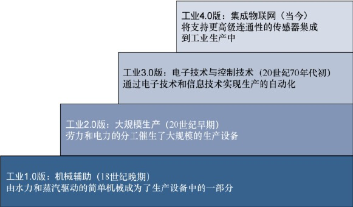

# 020-物联网的影响-工厂

[TOC]

## 传统工厂的劣势

很多年来，传统的工厂已经因为生产环境“无连接”而占尽劣势，这种劣势至少也是因为信息被“严格控制在”企业商业系统、供应链、客户和合作伙伴之间而造成的。

这类传统工厂的管理人员基本是“两眼一抹黑”，他们对企业的运作缺乏了解。这里的运作包括厂房车间、前台的运作和在独立仓库中供应方的运作。由于缺乏了解，修复各类宕机事故和质量问题，以及找出制造缺陷的根源，对于这类传统工厂往往并非易事。

### 当今工厂环境中的制造业面临的挑战

包括以下几点：

1. 需加速推出新的产品和服务，以便抓住客户和市场机会；
2. 提升工厂的生产力、质量和运行时间，同时降低生产成本；
3. 缓解计划外的宕机时间（这段时间平均消耗至少5%的生产力）；
4. 保护工厂免遭网络攻击的威胁；
5. 减少布线和重布线的功能（这类成本最多可能占部署总成本的60%）；
6. 提升工人的生产率和安全性。

火上浇油的是，这些挑战往往需要在生产业务的各个级别上进行解决。

- 执行管理人员希望有新的方式能够降低生产成本，以便平衡能源和材料成本的增加。
- 产品开发将市场视为第一要务。
- 厂房的经理则把自己的全部注意力都放在了工厂的生产效率和操作的灵活性上。
- 控制与自动化部门则负责管理工厂的网络系统、控制系统和应用，因此需要深入了解这些系统。

世界各地的工业类企业都在给工厂重新配备新的技术和架构，以便解决这些问题，同时提升生产的灵活性和效率。这些科技进步让企业的总体设备效率、供应链响应能力和客户满意度都迈上一个新的台阶。

将这些基于工厂的操作技术和架构与国际互联网进行融合，这个趋势刚刚显现出来，这种趋势就称为互联工厂。

## 智慧工厂的优势

- 分析数据的成本在降低
- 生产数据可追溯

## 分析数据的成本在降低

例如，一台熔炼设备从矿石中提取金属。这台设备使用加热和化学物质来分解矿石，留下纯金属。上述这个过程分成很多步骤，但所有的数据和控制系统需要在车间中的很多控制间中访问。

所以，操作人员必须走到控制间（往往在数百米开外）中来查看数据，对生产操作进行调整。大量的操作时间往往就浪费在了往返于操作间的路途之中。而在物联网和互联工厂的解决方案中，人们可以通过真正的“人机连接”，让传感器数据直接通过移动设备传输给车间中的操作人员。往返于控制间和车间的时间也被节省了下来。此外，由于操作人员能够实时收到数据，他们也就可以更加迅速地做出决策，这样可以提升生产效率，弥补生产中的质量问题。

## 生产数据可追溯

实时定位系统（Real-Time Location System，RTLS）是互联工厂解决方案的另一个应用示例。这种系统可以通过粘帖在任何材料上的小型WiFi RFID标签来提供该材料的实时位置和状态信息。这些标签可以让工厂追踪生产的情况。这些物联网传感器让流水线上的各个部件和材料能够与网络进行“交流”。如果人们能够对流水线上的产品实时进行跟踪，也就可以调节流水线的生产速度来实现既定的生产目标，人们也可以轻松判断出在产品生产的各个环节中，工作人员的工作效率。生产环节中的瓶颈和产品的质量问题同样会被迅速定位出来。

