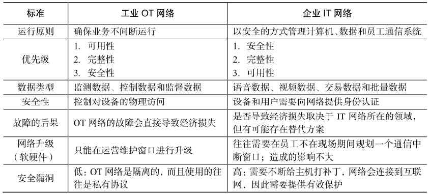

# 030-IT和OT的融合

[TOC]

## 简介

不久之前，信息技术（IT）和运营技术（OT）还不存在太多的交集。

- IT可以让人们与互联网，以及相关的数据和信息系统之间建立连接，它强调要保护一个机构发送的数据流。
- OT则会对物理操作系统中的设备和流程进行监测和控制。这里所说的系统包括流水线、电网、制造设备、道路系统等。

一般来说，IT不会介入OT的工业生产和流通环境当中。

#### 从类别上说

- IT机构负责管理企业的信息系统，比如电子邮件、文件和打印服务、数据库等。
- 而OT则负责管理工业环境中设备与流程的运行，比如工业机械、计量表、执行器、配电自动化设备、SCADA（监督控制与数据收集）系统等。

过去，OT使用的是专用网络，它有一套专用的协议来连接上述设备，而这些网络是与IT网络完全分离的。
OT的管理是企业的命脉。

比如，如果在一个工厂中，连接机器的网络出现了故障，那么这些机器就无法正常工作，生产也要就此停滞，这有可能会给企业带来数百万美元的经济损失。然而，如果（IT部门负责管理的）电子邮件服务器出现了故障，几个小时无法访问，或许有人会大发雷霆，但这种情况不太可能会给企业带来相同数量级的经济损失。

##  运营技术（OT）和信息技术（IT）之间的比较



随着物联网和标准协议（如IPv6）的涌现，IT和OT世界正在融合。

说得更准确一点就是，OT正在开始采用IT组织的那一套网络协议、技术、传输机制和方法，而IT组织也在开始对OT的运营需求提供支持。

当IT和OT开始使用同一个网络、协议和流程时，就会产生规模经济的效应。

这种融合不仅会减少搭建基础设施所需的经费，也会让网络变得更容易操作。因为开放标准十分灵活性，所以新的技术也很容易被采纳并且出现增长。
不过，

将IT和OT融合到一个网络中的趋势仍然面临很多挑战。这两种组织仍然存在着最基本的文化差异和优先级差异。物联网的发展正在迫使这些组织相互合作，而在过去，它们远比现在更加独立。

- 当OT机构发现，IT部门可以不考虑工业生产的需求，**自行规划在周末关闭网络以便对软件进行升级时**，OT机构就会大惑不解。

- IT部门也无法理解OT部署的那些私有或订制系统与解决方案。

让我们以在一个网络中部署服务质量（QoS）技术为例。在IT部门部署QoS时，按照最高优先级处理语音和视频流量几乎是一项普适法则。但是，当OT系统共享同一个网络时，OT从业会认为实时OT流量应该被赋予比语音流量更高的优先级，因为OT网络的任何故障都会导致直接的经济损失。
随着OT和IT的融合，两类系统都会进步。

OT看上去会更接近IT技术，因为它们也会采用诸如以太网和IP协议这样的公共标

