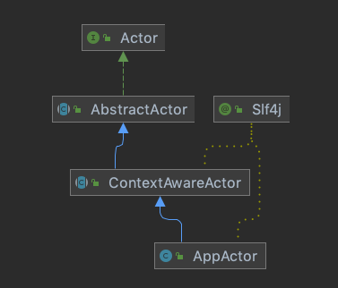

# 020-Actor生命周期-创建根Actor

[TOC]

## 什么是AppActor

AppActor是在ActorSystem启动时自动创建的重要组件之一 , 

## 继承结构




## 创建流程


```java
@PostConstruct
public void initActorSystem() {
  log.info("Initializing actor system.");
  actorContext.setActorService(this);
  ActorSystemSettings settings = new ActorSystemSettings(actorThroughput, schedulerPoolSize, maxActorInitAttempts);
  system = new DefaultActorSystem(settings);
  //初始化APP 分发器 , size = 1
  system.createDispatcher(APP_DISPATCHER_NAME, initDispatcherExecutor(APP_DISPATCHER_NAME, appDispatcherSize));
  //初始化规则分发器
  system.createDispatcher(RULE_DISPATCHER_NAME, initDispatcherExecutor(RULE_DISPATCHER_NAME, ruleDispatcherSize));
  //初始化引擎分发器
  system.createDispatcher(ENGINE_DISPATCHER_NAME, initDispatcherExecutor(ENGINE_DISPATCHER_NAME, engineDispatcherSize));

  actorContext.setActorSystem(system);
	//------↓↓↓↓↓↓↓↓↓↓↓↓↓↓↓↓↓↓↓↓------ 关注的代码 ------↓↓↓↓↓↓↓↓↓↓↓↓↓↓↓↓↓↓↓↓------//
  appActor = system.createRootActor(APP_DISPATCHER_NAME, new AppActor.ActorCreator(actorContext));
  //------↑↑↑↑↑↑↑↑↑↑↑↑↑↑↑↑↑↑------- 关注的代码------↑↑↑↑↑↑↑↑↑↑↑↑↑↑↑↑↑↑-------//
  actorContext.setAppActor(appActor);

  log.info("Actor system initialized.");
}
```

#### createRootActor

```java
    private ActorRef createActor(@Nonnull String dispatcherId, @Nonnull ActorCreator creator, @Nullable ActorId parent) {
        Assert.notNull(creator, "creator can not be null");
      //获取 Dispatcher
        Dispatcher dispatcher = dispatchers.get(dispatcherId);
        if (dispatcher == null) {
            logger.warn("Dispatcher with id [{}] is not registered!", dispatcherId);
            throw new ActorException("Dispatcher with id [" + dispatcherId + "] is not registered!");
        }
        ActorId actorId = creator.createActorId();
        DefaultActorMailbox actorMailbox = actors.get(actorId);
        if (Objects.nonNull(actorMailbox)) {
            logger.debug("Actor with id [{}] is already registered!", actorId);
            return actorMailbox;
        }
        // create actor
        Lock actorCreationLock = actorCreationLocks.computeIfAbsent(actorId, id -> new ReentrantLock());
        actorCreationLock.lock();
        try {
            actorMailbox = actors.get(actorId);
            if (Objects.isNull(actorMailbox)) {
                logger.debug("Creating actor with id [{}]!", actorId);
                Actor actor = creator.createActor();
                ActorRef parentRef = null;
                if (Objects.nonNull(parent)) {
                    parentRef = geActor(parent);
                    if (parentRef == null) {
                        throw new ActorNotRegisteredException(parent, "Parent Actor with id [" + parent + "] is not registered!");
                    }
                }
              //创建APPActor对应的 mailBox
                DefaultActorMailbox mailbox = new DefaultActorMailbox(this, settings, actorId, parentRef, actor, dispatcher);
                actors.put(actorId, mailbox);
              //初始化MailBox
                mailbox.initActor();
                actorMailbox = mailbox;
                if (Objects.nonNull(parent)) {
                                //维护关联关系
                    parentChildMap.computeIfAbsent(parent, id -> ConcurrentHashMap.newKeySet()).add(actorId);
                }
            } else {
                logger.debug("Actor with id [{}] is already registered!", actorId);
            }
        } finally {
            actorCreationLock.unlock();
            actorCreationLocks.remove(actorId);
        }
        return actorMailbox;
    }
```

