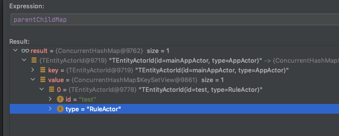

# 030-Actor生命周期-初始化根Actor

[TOC]

## 一言蔽之

初始化 Root Actor 也就是 AppActor之后, 会进行初始化, 将数据库以后的Rule加载到内存

## 初始化入口

```java
    private ActorRef createActor(@Nonnull String dispatcherId, @Nonnull ActorCreator creator, @Nullable ActorId parent) {
        Assert.notNull(creator, "creator can not be null");
      //获取 Dispatcher
        Dispatcher dispatcher = dispatchers.get(dispatcherId);
        if (dispatcher == null) {
            logger.warn("Dispatcher with id [{}] is not registered!", dispatcherId);
            throw new ActorException("Dispatcher with id [" + dispatcherId + "] is not registered!");
        }
        ActorId actorId = creator.createActorId();
        DefaultActorMailbox actorMailbox = actors.get(actorId);
        if (Objects.nonNull(actorMailbox)) {
            logger.debug("Actor with id [{}] is already registered!", actorId);
            return actorMailbox;
        }
        // create actor
        Lock actorCreationLock = actorCreationLocks.computeIfAbsent(actorId, id -> new ReentrantLock());
        actorCreationLock.lock();
        try {
            actorMailbox = actors.get(actorId);
            if (Objects.isNull(actorMailbox)) {
                logger.debug("Creating actor with id [{}]!", actorId);
                Actor actor = creator.createActor();
                ActorRef parentRef = null;
                if (Objects.nonNull(parent)) {
                    parentRef = geActor(parent);
                    if (parentRef == null) {
                        throw new ActorNotRegisteredException(parent, "Parent Actor with id [" + parent + "] is not registered!");
                    }
                }
              //创建APPActor对应的 mailBox
                DefaultActorMailbox mailbox = new DefaultActorMailbox(this, settings, actorId, parentRef, actor, dispatcher);
              //维护关联关系
                actors.put(actorId, mailbox);
              //初始化MailBox
                mailbox.initActor();
                actorMailbox = mailbox;
                if (Objects.nonNull(parent)) {
                    parentChildMap.computeIfAbsent(parent, id -> ConcurrentHashMap.newKeySet()).add(actorId);
                }
            } else {
                logger.debug("Actor with id [{}] is already registered!", actorId);
            }
        } finally {
            actorCreationLock.unlock();
            actorCreationLocks.remove(actorId);
        }
        return actorMailbox;
    }
```

#### mailbox.initActor();初始化


DefaultActorService

```java
@EventListener(ApplicationReadyEvent.class)
public void onApplicationEvent(ApplicationReadyEvent applicationReadyEvent) {
    log.info("Received application ready event. Sending application init message to actor system");
    appActor.tellWithHighPriority(new AppInitMsg());
}
```

## AppActor

```java
/**
 * 处理消息
 *
 * @param msg msg
 * @return 处理结果
 */
@Override
protected boolean doProcess(ActorMessage msg) {
    // 初始化加载规则链Actors
    if (!ruleChainsInitialized) {
      	//初始化所有规则
        initRulesActors();
        // 加载规则链数据完成
        ruleChainsInitialized = true;
        if (msg.getMessageType() != APP_INIT_MSG) {
            log.warn("Rule Chains initialized by unexpected message: {}", msg);
        }
    }
    ActorMessageType msgType = msg.getMessageType();

    if (APP_INIT_MSG.equals(msgType)) {
        // 应用初始化消息，直接return
        return false;
    } else if (QUEUE_TO_RULE_ENGINE_MSG.equals(msgType)) {
        // 处理队列到规则引擎消息
        onQueueToRuleEngineMsg((QueueToRuleEngineMsg) msg);
    } else if (COMPONENT_LIFE_CYCLE_MSG.equals(msgType)) {
        // 处理组件生命周期消息
        onComponentLifecycleMsg((ComponentLifecycleMsg) msg);
    } else {
        return false;
    }
    return true;
}
```

## initRulesActors

初始化

```java
    private void initRulesActors() {
        log.info("Starting main system actor.");
        try {
            // 获取所有规则链，并创建RuleActor
            List<String> ruleIds = ruleChainService.findRuleIds();
            for (String ruleId : ruleIds) {
                log.debug("[{}] Creating rule actor", ruleId);
              //创建所有的规则节点, 并创建成Actor
                ActorRef ref = checkOrCreateRuleActor(ruleId);
                if (ref != null) {
                    log.debug("[{}] Tenant actor created.", ruleId);
                }
            }
            // Main system actor started
            log.info("Main system actor started.");
        } catch (Exception e) {
            // Main system actor started Unknown failure
            log.warn("Unknown failure", e);
        }
    }
```

#### 创建规则链对应的ActorRef : checkOrCreateRuleActor

```java
/**
 * 创建规则链对应的ActorRef
 *
 * @param ruleId 规则链ID
 * @return ActorRef
 */
private ActorRef checkOrCreateRuleActor(String ruleId) {
    // 规则链存在则创建ActorRef
    if (ruleChainService.findCountRuleById(ruleId) > 0) {
        //根据规则链查找所有的规则节点并初始化
        return actorMailbox.getOrCreateChildActor(new TEntityActorId(ruleId, AppActor.class.getSimpleName()),
                //获取rule-engine的分发器
                () -> DefaultActorService.RULE_DISPATCHER_NAME,
                //创建的Actor 是 RuleActor
                () -> new RuleActor.ActorCreator(systemContext, ruleId));
    }
    return null;
}
```

#### 获取或者创建子Actor : getOrCreateChildActor

```java
/**
 * 获取或者创建子Actor
 *
 * @param actorId    actorId
 * @param dispatcher 分发行为
 * @param creator    创建行为
 * @return 引用
 */
@Nonnull
@Override
public ActorRef getOrCreateChildActor(ActorId actorId, Supplier<String> dispatcher, Supplier<ActorCreator> creator) {
    ActorRef actorRef = system.geActor(actorId);
    if (Objects.isNull(actorRef)) {
      //创建 对应的 Actor
        return system.createChildActor(dispatcher.get(), creator.get(), selfId);
    } else {
        return actorRef;
    }
}

```

## DefaultActorSystem : createChildActor 创建子Actor

```java
/**
 * 创建子(root)ActorReference
 *
 * @param dispatcherId 分发器ID
 * @param creator      创建器
 * @param parent       指定父上下文
 * @return 子上下文
 */
@Override
public ActorRef createChildActor(@Nonnull String dispatcherId, @Nonnull ActorCreator creator, @Nullable ActorId parent) {
    return createActor(dispatcherId, creator, parent);
}
```

```java
/**
 * 创建Actor
 */
private ActorRef createActor(@Nonnull String dispatcherId, @Nonnull ActorCreator creator, @Nullable ActorId parent) {
    Assert.notNull(creator, "creator can not be null");
    Dispatcher dispatcher = dispatchers.get(dispatcherId);
    if (dispatcher == null) {
        logger.warn("Dispatcher with id [{}] is not registered!", dispatcherId);
        throw new ActorException("Dispatcher with id [" + dispatcherId + "] is not registered!");
    }
    ActorId actorId = creator.createActorId();
    DefaultActorMailbox actorMailbox = actors.get(actorId);
    if (Objects.nonNull(actorMailbox)) {
        logger.debug("Actor with id [{}] is already registered!", actorId);
        return actorMailbox;
    }
    // create actor
    Lock actorCreationLock = actorCreationLocks.computeIfAbsent(actorId, id -> new ReentrantLock());
    actorCreationLock.lock();
    try {
        actorMailbox = actors.get(actorId);
        if (Objects.isNull(actorMailbox)) {
            logger.debug("Creating actor with id [{}]!", actorId);
            Actor actor = creator.createActor();
            ActorRef parentRef = null;
          //值得注意的是创建子Actor时要将父Actor的父查出
            if (Objects.nonNull(parent)) {
                parentRef = geActor(parent);
                if (parentRef == null) {
                    throw new ActorNotRegisteredException(parent, "Parent Actor with id [" + parent + "] is not registered!");
                }
            }
          //创建Actor对应的mailBoax时, 将parent传入
            DefaultActorMailbox mailbox = new DefaultActorMailbox(this, settings, actorId, parentRef, actor, dispatcher);
            actors.put(actorId, mailbox);
          //初始化
            mailbox.initActor();
            actorMailbox = mailbox;
            if (Objects.nonNull(parent)) 
            {//映射关系存储
                parentChildMap.computeIfAbsent(parent, id -> ConcurrentHashMap.newKeySet()).add(actorId);
            }
        } else {
            logger.debug("Actor with id [{}] is already registered!", actorId);
        }
    } finally {
        actorCreationLock.unlock();
        actorCreationLocks.remove(actorId);
    }
    return actorMailbox;
}
```

值得注意的是

parent 和Child 的Mapping关系

- key -> parent 
- value -> child 



```
TEntityActorId(id=mainAppActor, type=AppActor) -> TEntityActorId(id=test, type=RuleActor)
TEntityActorId(id=test, type=RuleActor) -> TEntityActorId(id=1436983073757966338, type=RuleChainActor)
```

