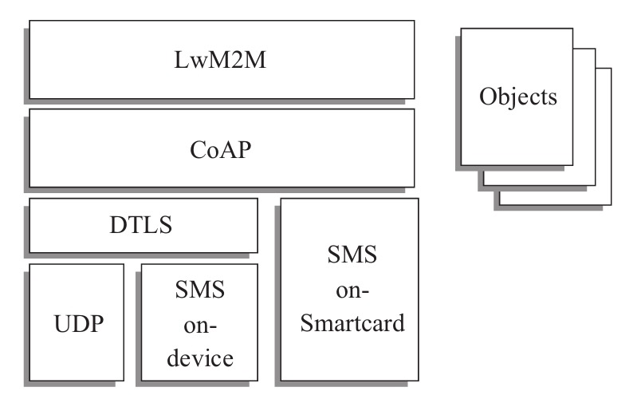

# 040-LwM2M协议

[TOC]

## 什么是LwM2M协议

LwM2M（Lightweight Machine-To-Machine）协议是由Open Mobile Alliance（OMA）定义的一套适用于物联网的轻量级协议。它使用RESTful接口，提供设备的接入、管理和通信功能，也适用于资源比较紧张的设备。

LwM2M协议的架构如图所示。

LwM2M协议底层使用CoAP协议传输数据和信令。

而在LwM2M协议的架构中，CoAP协议可以运行在UDP或者SMS（短信）之上，通过DTLS（数据报传输层安全）来实现数据的安全传输。

在没有移动数据网络覆盖的地区，比如偏远地区的水电站，用短信作为信息传输的载体已经有比较长的历史了。

LwM2M协议架构主要包含3种实体——

- LwM2M Bootstrap Server
- LwM2M Server
- LwM2M Client

LwM2M Bootstrap Server负责引导LwM2M Client注册并接入LwM2M Server，之后LwM2M Server和LwM2M Client就可以通过协议制定的接口进行交互

