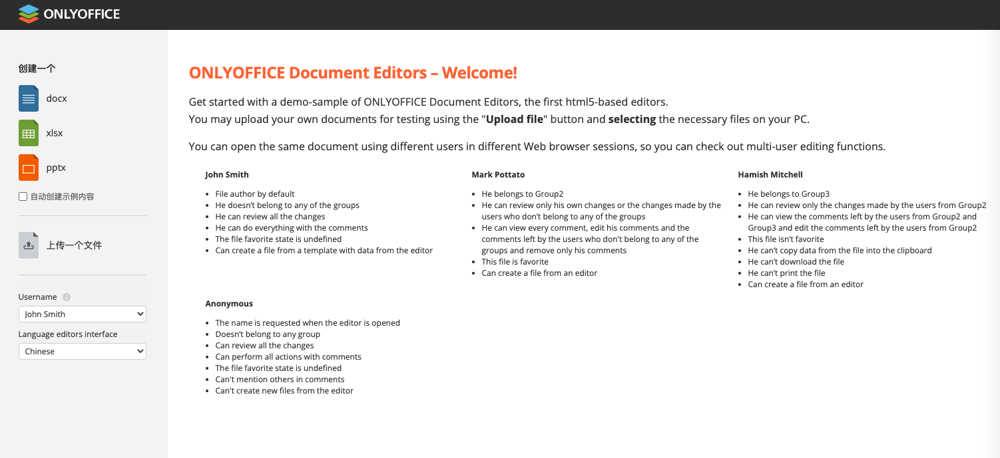

# 031-OnlyOffice官方示例-Java

[TOC]

## 前言

我们使用OnlyOffice可以将**在线编辑/协同编辑**等功能集成到协同办公里, 本章介绍如何集成官方实例,官方实例对我们的编程有很大的参考意义, 有助于我们理解OnlyOffice的集成方式以及基本原理

## 先看效果

官方实例的欢迎页面

## 集成步骤

1. 安装OnlyOffice()
2. 下载OnlyOffice官方实例源码
3. 修改配置,使用maven构建项目
4. 测试使用

### 1.安装OnlyOffice