# 010-XSS跨站脚本攻击

[TOC]


XSS攻击通常指的是通过利用网页开发时留下的漏洞，通过巧妙的方法注入恶意指令代码到网页，使用户加载并执行攻击者恶意制造的网页程序。这些恶意网页程序通常是JavaScript，但实际上也可以包括Java、 VBScript、ActiveX、 Flash 或者甚至是普通的HTML。攻击成功后，攻击者可能得到包括但不限于更高的权限（如执行一些操作）、私密网页内容、会话和cookie等各种内容。

XSS漏洞是Web应用程序中最常见的漏洞之一。如果您的站点没有预防XSS漏洞的固定方法，那么很可能就存在XSS漏洞。
这篇文章将带你通过代码层面去理解三个问题：

- 什么是XSS漏洞？
- XSS漏洞有哪些分类？
- 如何防范XSS漏洞？

## XSS 漏洞简介

跨站脚本攻击是指恶意攻击者往Web页面里插入恶意Script代码，当用户浏览该页之时，嵌入其中Web里面的Script代码会被执行，从而达到恶意攻击用户的目的。

- xss漏洞通常是通过php的输出函数将javascript代码输出到html页面中，通过用户本地浏览器执行的，所以xss漏洞关键就是**寻找参数未过滤的输出函数**。
- 常见的输出函数有： `echo printf print print_r sprintf die var-dump var_export`.

### **xss 分类**

- 反射型XSS：**<非持久化>** 攻击者事先制作好攻击链接, 需要欺骗用户自己去点击链接才能触发XSS代码（服务器中没有这样的页面和内容），一般容易出现在搜索页面。

- 存储型XSS：**<持久化>** 代码是存储在服务器中的，如在个人信息或发表文章等地方，加入代码，如果没有过滤或过滤不严，那么这些代码将储存到服务器中，每当有用户访问该页面的时候都会触发代码执行，这种XSS非常危险，容易造成蠕虫，大量盗窃cookie（虽然还有种DOM型XSS，但是也还是包括在存储型XSS内）。

- DOM型XSS：基于文档对象模型Document Objeet Model，DOM)的一种漏洞。DOM是一个与平台、编程语言无关的接口，它允许程序或脚本动态地访问和更新文档内容、结构和样式，处理后的结果能够成为显示页面的一部分。DOM中有很多对象，其中一些是用户可以操纵的，如uRI ，location，refelTer等。客户端的脚本程序可以通过DOM动态地检查和修改页面内容，它不依赖于提交数据到服务器端，而从客户端获得DOM中的数据在本地执行，如果DOM中的数据没有经过严格确认，就会产生DOM XSS漏洞。

##  反射型XSS

在黑盒测试中，这种类型比较容易通过漏洞扫描器直接发现，我们只需要按照扫描结果进行相应的验证就可以了。

相对的在白盒审计中， 我们首先要寻找带参数的输出函数，接下来通过输出内容回溯到输入参数，观察是否过滤即可。
 无案例不足以求真，这里我们选用`echo()函数`作为实例来分析：

新建` XssReflex.php`，代码如下:

```
<html>
<head> 
<meta http-equiv="Content-Type" content="text/html; charset=utf-8" /> 
<title>XSS</title> 
</head> 
<body> 
<form action="" method="get"> 
<input type="text" name="input">     
<input type="submit"> 
</form> 
<br> 
<?php 
$XssReflex = $_GET['input'];
echo 'output:<br>'.$XssReflex;
?> 
</body> 
</html> 
```

这是一个很简单、也很常见的页面：
 变量 $XssReflex 获取 get 方式传递的变量名为 input 的变量值（值为一个字符串），然后直接通过echo()函数输出，注意这中间并未对用户输入进行任何过滤。

打开Firefox输入url：`localhost/codeaudit/xss/XssReflex.php` :

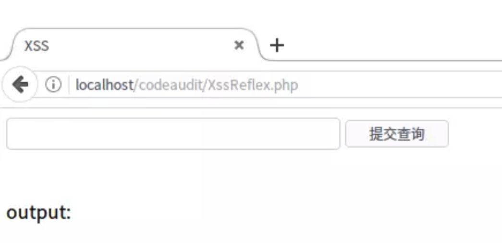

当我们输入 `1` ，页面返回 1 :

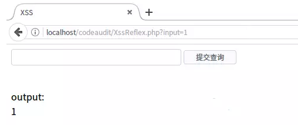

当我们输入`hello`时，页面返回 hello :

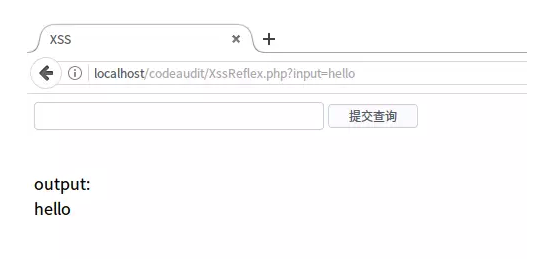

以上都为正常的输出，但如果我们输出一些`javascript`代码呢？

比如我们输入`alert('xss')` ：

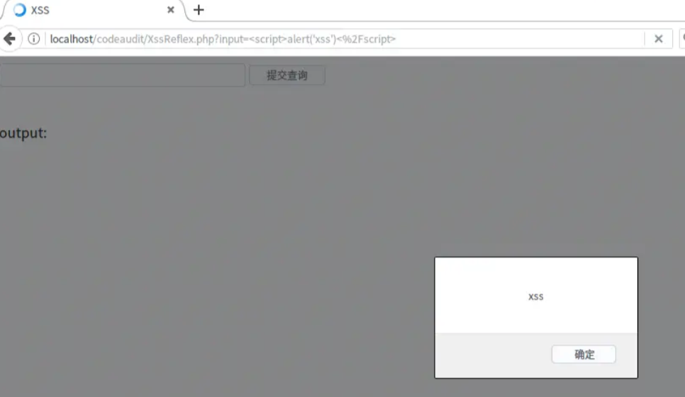

可以看到浏览器成功弹窗，说明我们输出的JavaScript代码成功被执行了。
我们查看网页html代码：

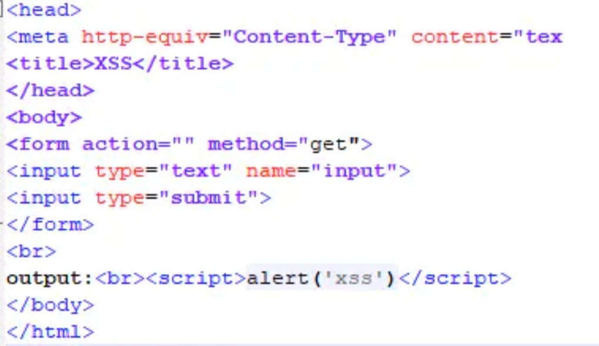

第12行增加了：

```xml
<script>alert('xss')</script>
```

这个弹窗并没有什么实际的意义，但通过它我们知道输入javascript代码是可以被执行的，当我们输入一些其他函数，比如`document.cookie`就可以成功盗取用户的cookie信息，或者读取用户浏览器信息等，为我们进一步深入攻击做铺垫。

### 存储型XSS

和反射性XSS的即时响应相比，存储型XSS则需要先把利用代码保存在比如数据库或文件中，当web程序读取利用代码时再输出在页面上执行利用代码。但存储型XSS不用考虑绕过浏览器的过滤问题，屏蔽性也要好很多。
 存储型XSS攻击流程：

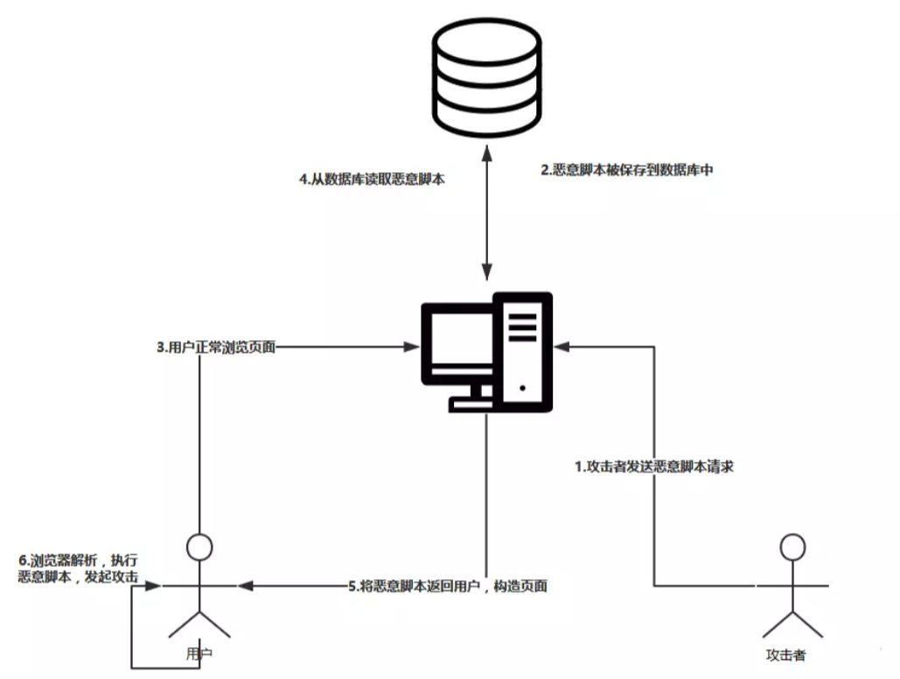

存储型XSS的白盒审计同样要寻找未过滤的输入点和未过滤的输出函数。

使用cat命令查看 XssStorage.php 代码

```bash
shiyanlou:~/ $ cat XssStorage.php
```

```java
<span style="font-size:18px;"><meta http-equiv="Content-Type" content="text/html;charset=utf-8"/>  
    <html>  
    <head>  
    <title>XssStorage</title>  
    </head>  
    <body>  
    <h2>Message Board<h2>  
    <br>
    <form action="XssStorage.php" method="post">  
    Message:<textarea id='Mid' name="desc"></textarea>  
    <br>  
    <br>  
    Subuser:<input type="text" name="user"/><br> 
    <br>
    <input type="submit" value="submit" onclick='loction="XssStorage.php"'/>  
    </form>  
    <?php  
    if(isset($_POST['user'])&&isset($_POST['desc'])){  
    $log=fopen("sql.txt","a");  
    fwrite($log,$_POST['user']."\r\n");  
    fwrite($log,$_POST['desc']."\r\n");  
    fclose($log);  
    }  
      
    if(file_exists("sql.txt"))  
    {  
    $read= fopen("sql.txt",'r');  
    while(!feof($read))  
    {  
        echo fgets($read)."</br>";  
    }  
    fclose($read);  
    }  
    ?>  
    </body>  
    </html></span>  
```

这个页面采用POST提交数据，生成、读取文本模拟数据库，提交数据之后页面会将数据写入sql.txt，再打开页面时会读取sql.txt中内容并显示在网页上，实现了存储型xss攻击模拟。

打开Firefox输入url：`localhost/codeaudit/xss/XssStorage.php` :

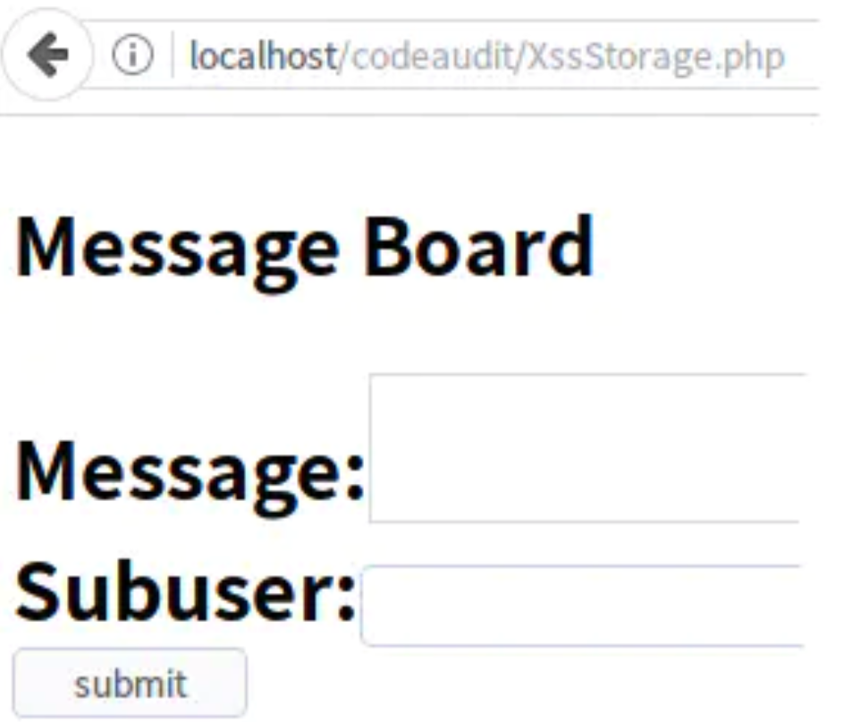

我们随意输出一些内容：

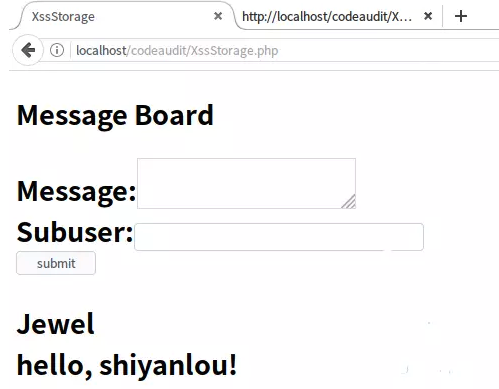

可以看到页面正常显示页面留言信息。
当我们在Message中输入`alert('xss')`时，页面成功弹窗 :

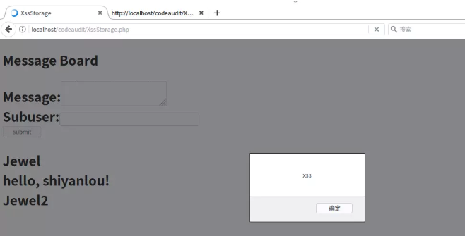

并且我们重启浏览器之后再加载该页面，页面依然会弹窗,这是因为恶意代码已经写入数据库中，每当有人访问该页面时，恶意代码就会被加载执行！

我们查看网页html代码：

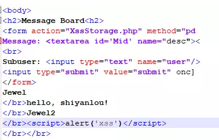

这就是所谓的存储型XSS漏洞，**一次提交之后，每当有用户访问这个页面都会受到XSS攻击，危害巨大。**

### DOM XSS

## XSS漏洞防范

###  反射型xss漏洞防范

php中xss的漏洞防范方法总结：<参考自Segmentfault>

```jewel
A.PHP直接输出html的，可以采用以下的方法进行过滤：

    1.htmlspecialchars函数
    2.htmlentities函数
    3.HTMLPurifier.auto.php插件
    4.RemoveXss函数

B.PHP输出到JS代码中，或者开发Json API的，则需要前端在JS中进行过滤：

    1.尽量使用innerText(IE)和textContent(Firefox),也就是jQuery的text()来输出文本内容
    2.必须要用innerHTML等等函数，则需要做类似php的htmlspecialchars的过滤

C.其它的通用的补充性防御手段

    1.在输出html时，加上Content Security Policy的Http Header
    （作用：可以防止页面被XSS攻击时，嵌入第三方的脚本文件等）
    （缺陷：IE或低版本的浏览器可能不支持）
    2.在设置Cookie时，加上HttpOnly参数
    （作用：可以防止页面被XSS攻击时，Cookie信息被盗取，可兼容至IE6）
    （缺陷：网站本身的JS代码也无法操作Cookie，而且作用有限，只能保证Cookie的安全）
    3.在开发API时，检验请求的Referer参数
    （作用：可以在一定程度上防止CSRF攻击）
    （缺陷：IE或低版本的浏览器中，Referer参数可以被
```

这里我们选用htmlentities()函数进行测试：

> htmlentities() 函数把字符转换为 HTML 实体。

新建Xss_htmlentities.php， 代码如下：

```xml
<html>
<head> 
<meta http-equiv="Content-Type" content="text/html; charset=utf-8" /> 
<title>XSS</title> 
</head> 
<body> 
<form action="" method="get"> 
<input type="text" name="input">     
<input type="submit"> 
</form> 
<br> 
<?php 
$XssReflex = $_GET['input'];
echo 'output:<br>'.htmlentities($XssReflex);#仅在这里对变量 $XssReflex 做了处理.
?> 
</body> 
</html> 
```

在Firefox输入url：`localhost/codoaudit/xss/Xsshtmlentities.php` :

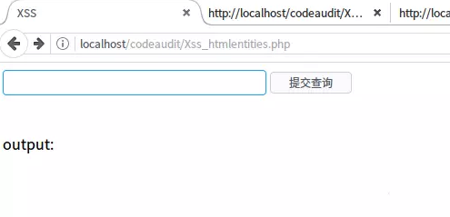

当我们输入`alert('xss')` ：

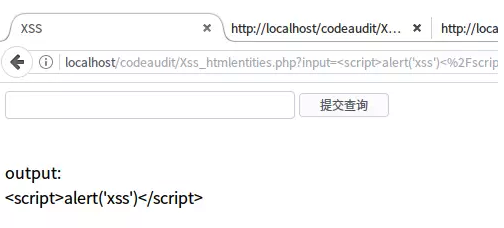

可以看到页面并没有弹窗。
我们再查看网页html代码：

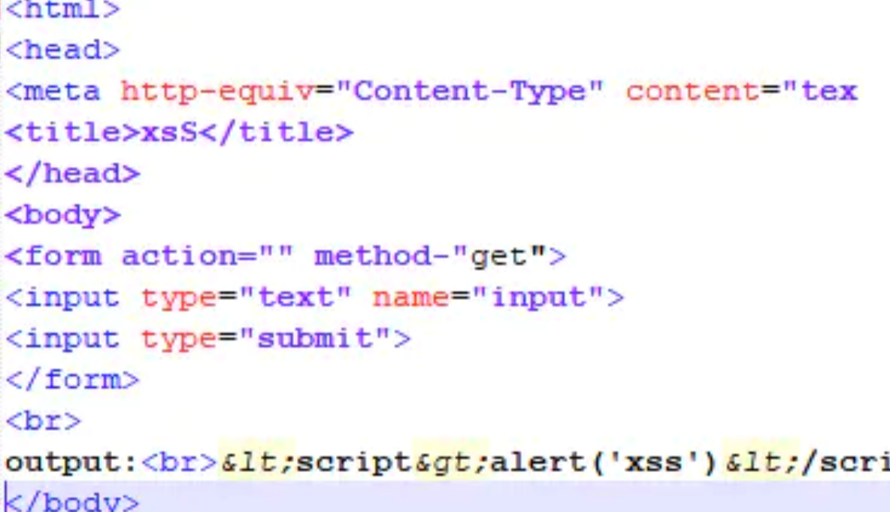

可以看到htmlentities()函数对用户输入的`<>`做了转义处理,恶意代码当然也就没法执行了。
还有其他过滤函数，纸上学来终觉浅，有兴趣的同学可以自己去尝试一番

### 存储型xss漏洞防范

存储型XSS对用户的输入进行过滤的方式和反射型XSS相同，这里我们使用`htmlspecialchars()`函数进行演示：

> htmlentities() :把预定义的字符 "<" （小于）和 ">" （大于）转换为 HTML 实体

htmlspecialchars和htmlentities的区别：

htmlspecialchars 只转义 `& 、" 、' 、< 、>` 这几个html代码，而 htmlentities 却会转化所有的html代码，连同里面的它无法识别的中文字符也会转化。

新建Xss_htmlspecialchars_Storage.php ，代码如下:


```php
  <span style="font-size:18px;"><meta http-equiv="Content-Type" content="text/html;charset=utf-8"/>  
    <html>  
    <head>  
    <title>XssStorage</title>  
    </head>  
    <body>  
    <h2>Message Board<h2>  
    <br>
    <form action="Xss_htmlspecialchars_Storage.php" method="post">  
    Message:<textarea id='Mid' name="desc"></textarea>  
    <br>  
    <br>  
    Subuser:<input type="text" name="user"/><br> 
    <br>
    <input type="submit" value="submit" onclick='loction="XssStorage.php"'/>  
    </form>  
    <?php  
    if(isset($_POST['user'])&&isset($_POST['desc'])){  
    $log=fopen("sqlStorage.txt","a");  
    fwrite($log,htmlspecialchars($_POST['user'])."\r\n"); # 在此对用户输入数据$_POST['user']进行过滤
    fwrite($log,htmlspecialchars($_POST['desc'])."\r\n"); # 在此对用户输入数据$_POST['desc']进行过滤
    fclose($log);  
    }  
      
    if(file_exists("sqlStorage.txt"))  
    {  
    $read= fopen("sqlStorage.txt",'r');  
    while(!feof($read))  
    {  
        echo fgets($read)."</br>";  
    }  
    fclose($read);  
    }  
    ?>  
    </body>  
    </html></span>  
```


在Firefox输入url：`localhost/codoaudit/xss/Xss_htmlspecialchars_Storage.php` :

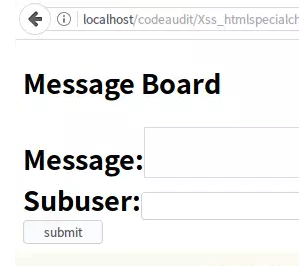


当我们在Message中输入`alert('xss')` ：

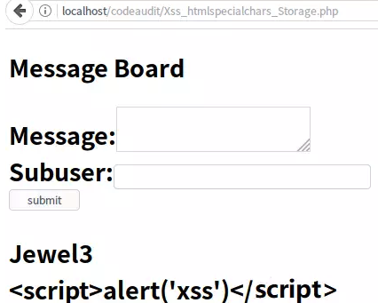

可以看到页面并没有弹窗。
我们再查看网页html代码：

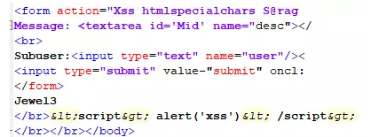