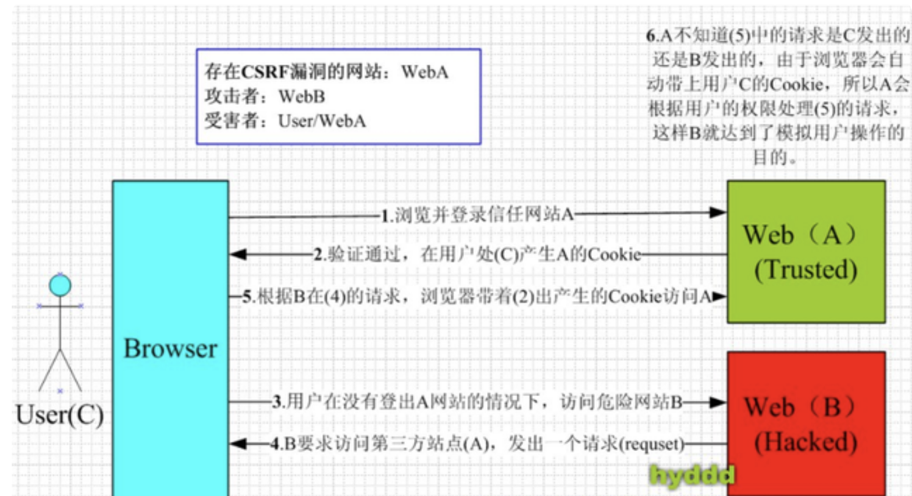

# 020-CSRF跨站请求伪造攻击

[TOC]

## 简介

CSRF（Cross-site request forgery）跨站请求伪造，也被称为“One Click Attack”或者Session Riding，通常缩写为CSRF或者XSRF，是一种对网站的恶意利用。尽管听起来像跨站脚本（XSS），但它与XSS非常不同，XSS利用站点内的信任用户，而CSRF则通过伪装来自受信任用户的请求来利用受信任的网站。与XSS攻击相比，CSRF攻击往往不大流行（因此对其进行防范的资源也相当稀少）和难以防范，所以被认为比XSS更具危险性。

## 攻击原理

攻击者盗用了你的身份，以你的名义发送恶意请求

1. 用户C打开浏览器，访问受信任网站A，输入用户名和密码请求登录网站A；
2. 在用户信息通过验证后，网站A产生Cookie信息并返回给浏览器，此时用户登录网站A成功，可以正常发送请求到网站A；
3. 用户未退出网站A之前，在同一浏览器中，打开一个TAB页访问网站B；
4. 网站B接收到用户请求后，返回一些攻击性代码，并发出一个请求要求访问第三方站点A；

### 防御原理

CSRF攻击的要点就是在向服务器发送请求的时候，相应的`cookie`会自动的发送给对应的服务器。造成服务器不知道这个请求是用户发起的还是伪造的。

这时候，我们可以在用户每次访问有表单的页面的时候，在网页源代码中加一个随机的字符串叫做`csrf_token`，在`cookie`中也加入一个相同值的`csrf_token`字符串。

以后给服务器发送请求的时候，必须在`body`中以及`cookie`中都携带`csrf_token`，服务器只有检测到`cookie`中的`csrf_token`和`body`中的`csrf_token`都相同，才认为这个请求是正常的，否则就是伪造的。那么黑客就没办法伪造请求了。