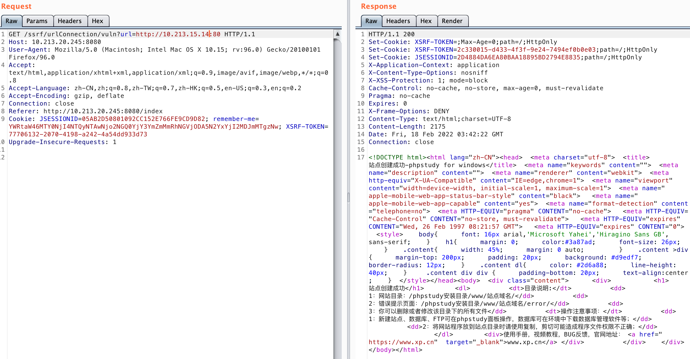

# 030-SSRF服务器请求伪造攻击

[TOC]

## **漏洞介绍**

服务端请求伪造(Server-Side Request Forgery),指的是攻击者在未能取得服务器所有权限时，利用服务器漏洞以服务器的身份发送一条构造好的请求给服务器所在内网。SSRF攻击通常针对外部网络无法直接访问的内部系统。

## **修复建议**

1. 过滤返回的信息，如果web应用是去获取某一种类型的文件。那么在把返回结果展示给用户之前先验证返回的信息是否符合标准。
2. 统一错误信息，避免用户可以根据错误信息来判断远程服务器的端口状态。
3. 限制请求的端口，比如80,443,8080,8090。
4. 禁止不常用的协议，仅仅允许http和https请求。可以防止类似于file:///，gopher://，ftp://等引起的问题。
5. 使用DNS缓存或者Host白名单的方式。

## **漏洞示例**

**访问内网另一台机器10.213.15.14的80端口**

