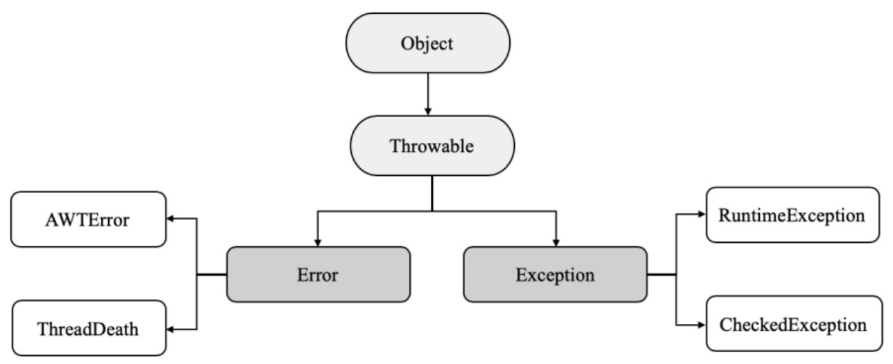

# [QA]受检异常与非受检异常(运行时异常)

在Java中，Throwable是所有错误或异常的父类，Throwable又可分为Error和Exception，常见的Error有AWTError、ThreadDeath，Exception又可分为RuntimeException和CheckedException，如图所示。

## Error指Java程序运行错误

如果程序在启动时出现Error，则启动失败；

如果程序在运行过程中出现Error，则系统将退出进程。出现Error通常是因为系统的内部错误或资源耗尽，Error不能被在运行过程中被动态处理。如果程序出现Error，则系统能做的工作也只能有记录错误的成因和安全终止。

## Exception指Java程序运行异常

Exception指Java程序运行异常，即运行中的程序发生了人们不期望发生的事件，可以被Java异常处理机制处理。Exception也是程序开发中异常处理的核心，可分为RuntimeException（运行时异常）和CheckedException（检查异常）

- RuntimeException(运行时异常)：指在Java虚拟机正常运行期间抛出的异常，RuntimeException可以被捕获并处理，如果出现RuntimeException，那么一定是程序发生错误导致的。我们通常需要抛出该异常或者捕获并处理该异常。

  > 常见的RuntimeException有 NullPointerException、ClassCastException、ArrayIndexOutOfBundsException等。

- CheckedException(受检异常)：指在编译阶段Java编译器会检查CheckedException异常并强制程序捕获和处理此类异常，即要求程序在可能出现异常的地方通过try catch语句块捕获并处理异常。

  > 常见的CheckedException有由于I/O 错误导致的IOException、SQLException、ClassNotFoundException等。该类异常一般由于打开错误的文件、SQL语法错误、类不存在等引起。

