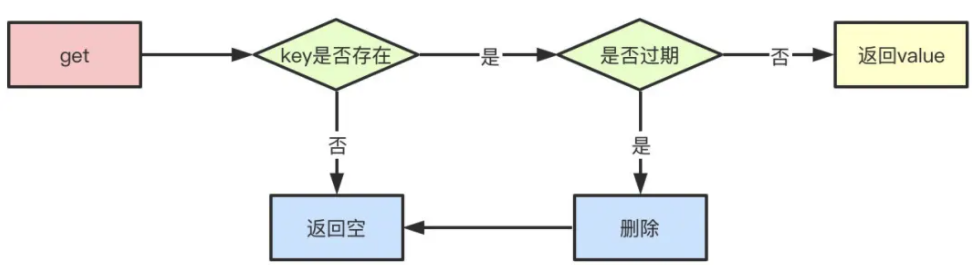

#  Redis内存满了怎么办

---

[TOC]

Redis内存超出我们设置的最大内存(redis.conf文件的 maxmemory)的时候, 会有一系列淘汰策略

redis主要有2种过期删除策略

- **惰性删除**

- ##### 定期删除

## **惰性删除**

惰性删除指的是当我们查询key的时候才对key进行检测，如果已经达到过期时间，则删除。显然，他有一个缺点就是如果这些过期的key没有被访问，那么他就一直无法被删除，而且一直占用内存。

## 定期删除

定期删除指的是redis每隔一段时间对数据库做一次检查，删除里面的过期key。由于不可能对所有key去做轮询来删除，所以redis会每次随机取一些key去做检查和删除。

## 那么定期+惰性都没有删除过期的key怎么办？

假设redis每次定期随机查询key的时候没有删掉，这些key也没有做查询的话，就会导致这些key一直保存在redis里面无法被删除，这时候就会走到redis的内存淘汰机制。

1. volatile-lru：从已设置过期时间的key中，移出最近最少使用的key进行淘汰
2. volatile-ttl：从已设置过期时间的key中，移出将要过期的key
3. volatile-random：从已设置过期时间的key中随机选择key淘汰
4. allkeys-lru：从key中选择最近最少使用的进行淘汰
5. allkeys-random：从key中随机选择key进行淘汰
6. noeviction：当内存达到阈值的时候，新写入操作报错

总体来说分为三类

- [不淘汰](#不淘汰)
- [所有key淘汰](#所有key淘汰)
- [有过期时间的key淘汰](#有过期时间的key淘汰)

### 不淘汰

默认情况下策略是不淘汰

| 策略           | 含义                                                         |
| -------------- | ------------------------------------------------------------ |
| **noeviction** | 不会继续服务写请求(del 请求可以继续服务), 读请求可以继续进行, 这样可以保证不会丢失数据, 但是会让线上的业务不能持续进行, 这是默认的**淘汰策略** |

### 所有key淘汰

所有key淘汰分3中算法

| 策略               |                | 含义                                                         |
| ------------------ | -------------- | ------------------------------------------------------------ |
| **allkeys-lru**    | 最近最少使用   | 区别于 volatile-lru 这个策略要淘汰的 key 对象时全体 key 集合,没有设置过期的 key 也会被剔除 |
| **allkeys-random** | 随机           | 跟上面几乎一模一样,不过淘汰的 key 是随机的 key               |
| **allkeys-lfu**    | 最近最久未使用 | 在所有的键中选择最不常用的，不管数据有没有设置超时属性。     |

### 有过期时间的key淘汰

| 策略                |                | 含义                                                         |
| ------------------- | -------------- | ------------------------------------------------------------ |
| **volatile-lru**    | 最近最少使用   | 根据 LRU 算法删除设置了超时属性(expire)的键，直到腾出足够内存为止。如果没有可删除的键对象，回退到 noeviction 策略。 |
| **volatile-random** | 随机           | 和 **allkeys-lru** 几乎一模一样,不过淘汰的 key 是过期 key 集合中随机 key |
| **volatile-lfu**    | 最近最久未使用 | 在带有过期时间的键中选择最不常用的。                         |
| **volatile-ttl**    | 根据寿命       | 跟上面几乎一样,不过淘汰策略不是 LRU, 而是比较 key 的剩余寿命 ttl , ttl越小越优先淘汰 |

 [02-淘汰策略.md](../../13-persistence/02-Redis/17-内存回收/02-淘汰策略.md) 

## 如何选这些策略

- 如果你只是拿 Redis 做缓存,那么应该使用 allkey 策略,客户端写缓存时不必携带过期时间
- 如果你同时想使用 Redis 持久化功能,那就使用 volatile-xxx 策略,这样可以保留没有设置过期时间的 key,他们是永久的 key,不会被 LRU 算法淘汰