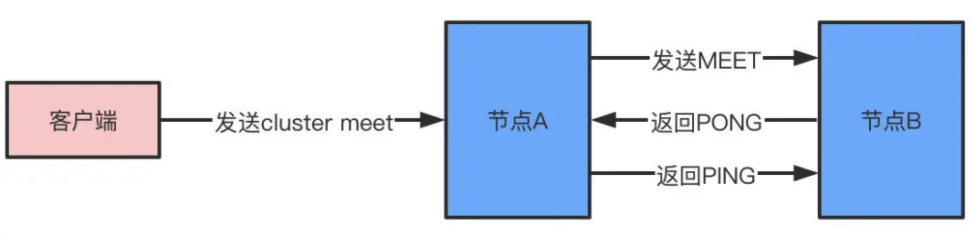
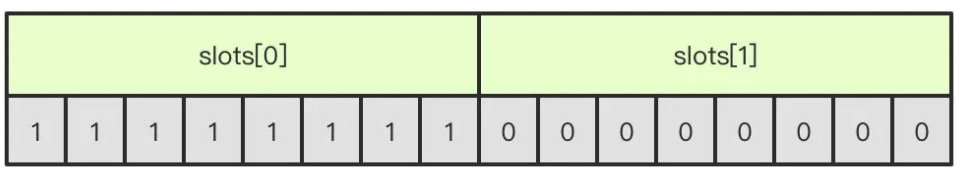
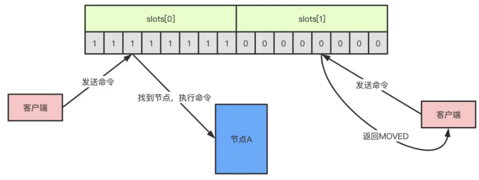

# [QA]说一说RedisCluster的理解

## 相关知识点

 [040-Redis-cluster.md](../../13-persistence/02-Redis/04-Redis集群/040-Redis-cluster.md) 

 [041-一致性哈希.md](../../13-persistence/02-Redis/04-Redis集群/041-一致性哈希.md) 

## 介绍

**因为**Redis主从主要解决的是对主节点读的压力,并没有解决写的压力,**所以**需要一种能够横向拓展的集群架构来解决这个问题, RedisCluster通过分片(sharding)来进行数据共享,并提供复制和故障迁移功能

#### 数据怎么相对均匀地分片

实际上RedisCluster采用的是数据分片的思想,它采用 **一致性Hash算法**将所有节点分为 0 - 2^32 (16384) 个 槽位, 每次新增节点仅仅会影响下一个相邻的节点

我们建立集群后,每个节点都会负责一部分的槽位,Redis会自动创建集群方案,当然我们也可以手动使用cluster meet命令加入

## 重点

- 节点直接通过握手来将其他节点添加到自己所处的集群当中
- **集群中的18384 个槽可以分别指派给集群的各个节点,每个节点都会记录 槽位和节点的映射关系**
- 节点在接到一个命令请求时,会先检查这个命令请求要处理的键所在的槽是否由自己负责,如果不是的话,节点将会向客户端返回一个MOVED错误,MOVED错误携带的信息可以指引客户端转向正在负责的槽的节点
- 对Redis集群的重新分片工作是由redis-trib负责执行的, 重新分片的关键是将属于某个槽的所有键值从一个节点转移到另一个节点
- 如果节点A正在迁移槽i至节点B,那么当节点A没能在自己的数据库中找到命令时,节点A会向客户端返回一个ASK错误,指引客户端到节点B继续寻找指定的key
- MOVED错误表示槽的负责权利已经从一个节点转移到了另外一个节点,而ASK错误只是两个节点在迁移槽的过程中使用的一种临时措施
- 集群中的从节点用于复制主节点,并在主节点下线时,代替主节点继续处理命令请求
- 集群中的节点通过发送和接受消息来进行通讯,常见的消息包括MEET,PING,PONG,PUBLISH FAIL五种

## 如何建立集群

在启动redis的时候,我们可以使用

```
redis-cli --cluster create IP:端口 IP:端口 IP:端口 IP:端口 IP:端口 IP:端口 --cluster-replicas 1
```

命令创建一个集群, Redis会自动给我们一个方案,例如 6个服务器, 那么它会帮我们分成3个一主一从

一个redis集群由多个节点node组成，而多个node之间通过cluster meet命令来进行连接，节点的握手过程：

1. 节点A收到客户端的cluster meet命令
2. A根据收到的IP地址和端口号，向B发送一条meet消息
3. 节点B收到meet消息返回pong
4. A知道B收到了meet消息，返回一条ping消息，握手成功
5. 最后，节点A将会通过gossip协议把节点B的信息传播给集群中的其他节点，其他节点也将和B进行握手



## **槽slot**

redis通过集群分片的形式来保存数据，整个集群数据库被分为16384个slot，集群中的每个节点可以处理0-16384个slot，当数据库16384个slot都有节点在处理时，集群处于上线状态，反之只要有一个slot没有得到处理都会处理下线状态。通过cluster addslots命令可以将slot指派给对应节点处理。

slot是一个位数组，数组的长度是16384/8=2048，而数组的每一位用1表示被节点处理，0表示不处理，如图所示的话表示A节点处理0-7的slot。



当客户端向节点发送命令，如果刚好找到slot属于当前节点，那么节点就执行命令，反之，则会返回一个MOVED命令到客户端指引客户端转向正确的节点。（MOVED过程是自动的）



如果增加或者移出节点，对于slot的重新分配也是非常方便的，redis提供了工具帮助实现slot的迁移，整个过程是完全在线的，不需要停止服务。

##  故障转移

如果节点A向节点B发送ping消息，节点B没有在规定的时间内响应pong，那么节点A会标记节点B为pfail疑似下线状态，同时把B的状态通过消息的形式发送给其他节点，如果超过半数以上的节点都标记B为pfail状态，B就会被标记为fail下线状态，此时将会发生故障转移，优先从复制数据较多的从节点选择一个成为主节点，并且接管下线节点的slot，整个过程和哨兵非常类似，都是基于Raft协议做选举。