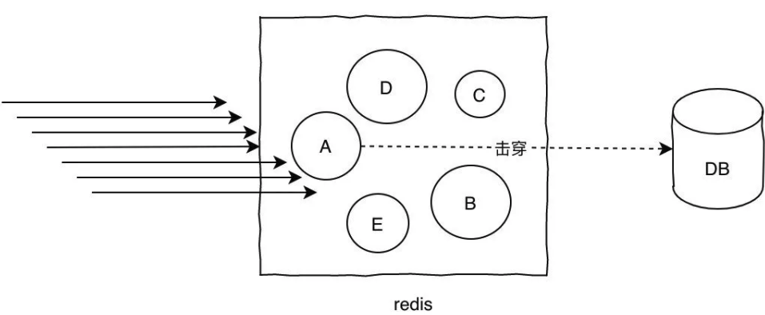
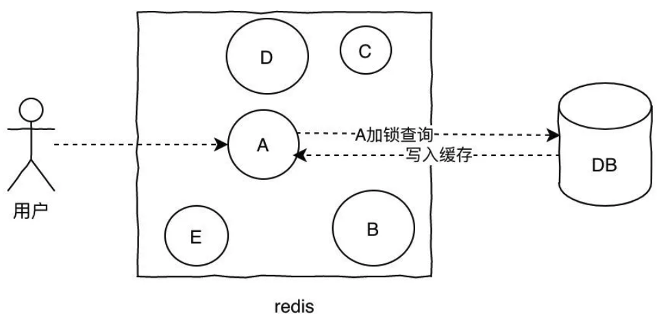
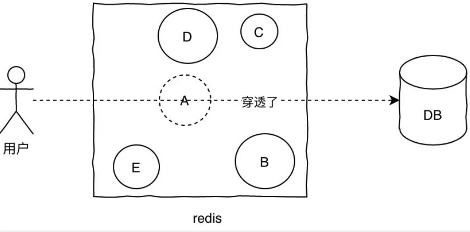
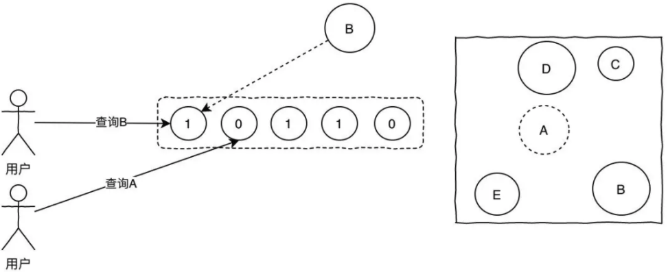
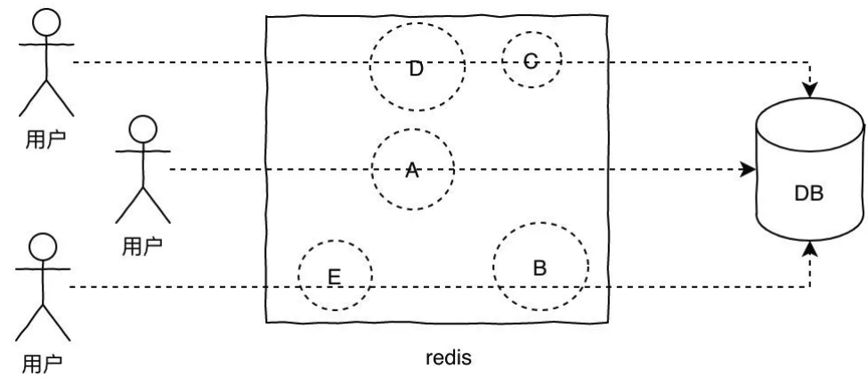

# 什么是缓存击穿、缓存穿透、缓存雪崩？

## 缓存击穿

缓存击穿的概念就是单个key并发访问过高，过期时导致所有请求直接打到db上，这个和热key的问题比较类似，只是说的点在于过期导致请求全部打到DB上而已。

解决方案：

1. 加锁更新，比如请求查询A，发现缓存中没有，对A这个key加锁，同时去数据库查询数据，写入缓存，再返回给用户，这样后面的请求就可以从缓存中拿到数据了。
2. 将过期时间组合写在value中，通过异步的方式不断的刷新过期时间，防止此类现象。

## **缓存穿透**

缓存穿透是指查询不存在缓存中的数据，每次请求都会打到DB，就像缓存不存在一样。

针对这个问题，加一层布隆过滤器。布隆过滤器的原理是在你存入数据的时候，会通过散列函数将它映射为一个位数组中的K个点，同时把他们置为1。

这样当用户再次来查询A，而A在布隆过滤器值为0，直接返回，就不会产生击穿请求打到DB了。

显然，使用布隆过滤器之后会有一个问题就是误判，因为它本身是一个数组，可能会有多个值落到同一个位置，那么理论上来说只要我们的数组长度够长，误判的概率就会越低，这种问题就根据实际情况来就好了。

## 缓存雪崩

当某一时刻发生大规模的缓存失效的情况，比如你的缓存服务宕机了，会有大量的请求进来直接打到DB上，这样可能导致整个系统的崩溃，称为雪崩。雪崩和击穿、热key的问题不太一样的是，他是指大规模的缓存都过期失效了。

针对雪崩几个解决方案：

1. 针对不同key设置不同的过期时间，避免同时过期
2. 限流，如果redis宕机，可以限流，避免同时刻大量请求打崩DB
3. 二级缓存，同热key的方案。

## 