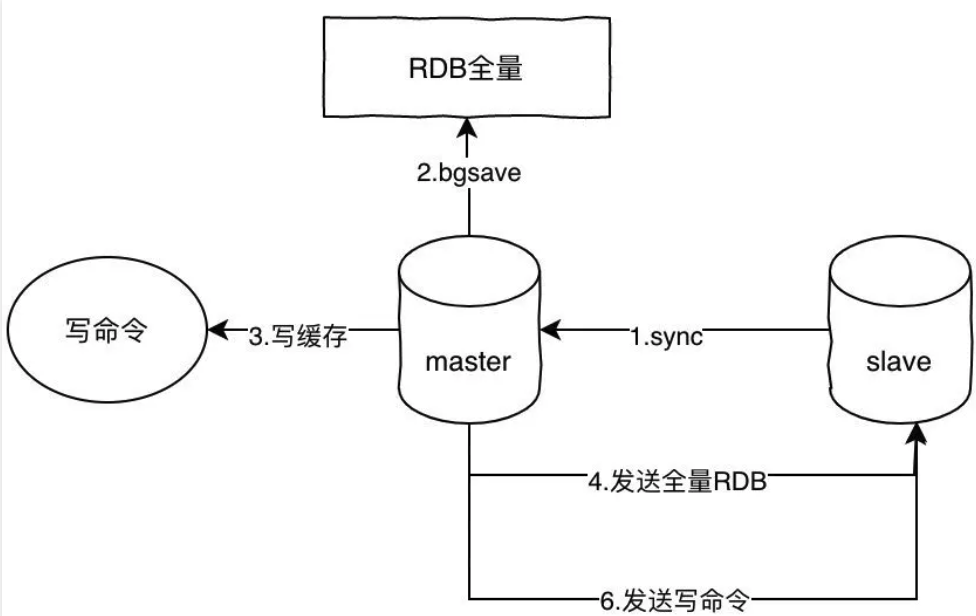
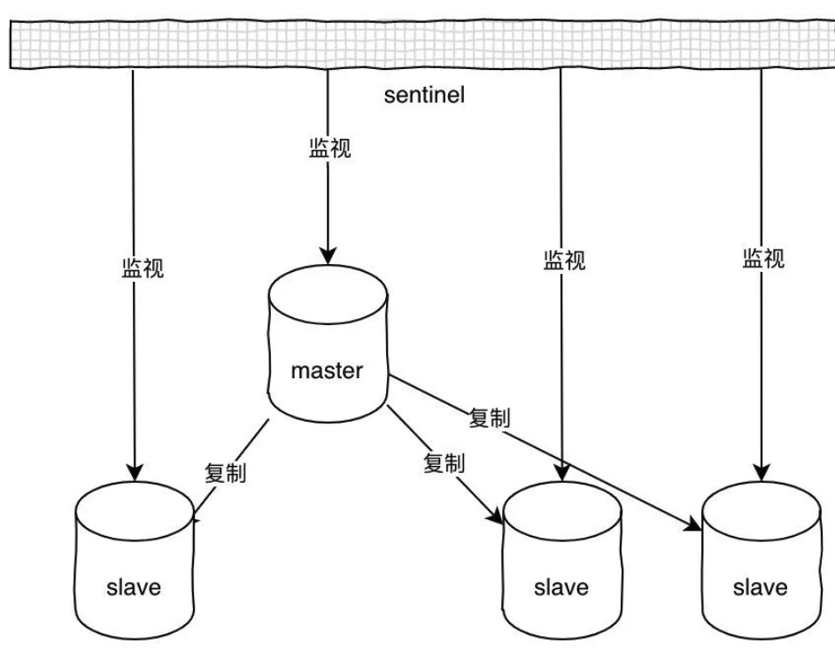

# 怎么实现Redis的高可用

要想实现高可用，一台机器肯定是不够的，而redis要保证高可用，有2个可选方案。

## **主从架构**

主从模式是最简单的实现高可用的方案，核心就是主从同步。主从同步的原理如下：

1. slave发送sync命令到master
2. master收到sync之后，执行bgsave，生成RDB全量文件
3. master把slave的写命令记录到缓存
4. bgsave执行完毕之后，发送RDB文件到slave，slave执行
5. master发送缓存中的写命令到slave，slave执行

这里我写的这个命令是sync，但是在redis2.8版本之后已经使用psync来替代sync了，原因是sync命令非常消耗系统资源，而psync的效率更高。

## **哨兵**

基于主从方案的缺点还是很明显的，假设master宕机，那么就不能写入数据，那么slave也就失去了作用，整个架构就不可用了，除非你手动切换，主要原因就是因为没有自动故障转移机制。而哨兵(sentinel)的功能比单纯的主从架构全面的多了，它具备自动故障转移、集群监控、消息通知等功能。

哨兵可以同时监视多个主从服务器，并且在被监视的master下线时，自动将某个slave提升为master，然后由新的master继续接收命令。整个过程如下：

1. 初始化sentinel，将普通的redis代码替换成sentinel专用代码
2. 初始化masters字典和服务器信息，服务器信息主要保存ip:port，并记录实例的地址和ID
3. 创建和master的两个连接，命令连接和订阅连接，并且订阅sentinel:hello频道
4. 每隔10秒向master发送info命令，获取master和它下面所有slave的当前信息
5. 当发现master有新的slave之后，sentinel和新的slave同样建立两个连接，同时每个10秒发送info命令，更新master信息
6. sentinel每隔1秒向所有服务器发送ping命令，如果某台服务器在配置的响应时间内连续返回无效回复，将会被标记为下线状态
7. 选举出领头sentinel，领头sentinel需要半数以上的sentinel同意
8. 领头sentinel从已下线的的master所有slave中挑选一个，将其转换为master
9. 让所有的slave改为从新的master复制数据
10. 将原来的master设置为新的master的从服务器，当原来master重新回复连接时，就变成了新master的从服务器

sentinel会每隔1秒向所有实例（包括主从服务器和其他sentinel）发送ping命令，并且根据回复判断是否已经下线，这种方式叫做主观下线。当判断为主观下线时，就会向其他监视的sentinel询问，如果超过半数的投票认为已经是下线状态，则会标记为客观下线状态，同时触发故障转移。