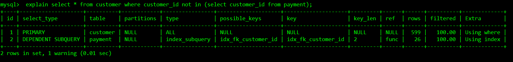
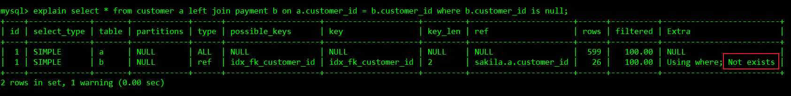
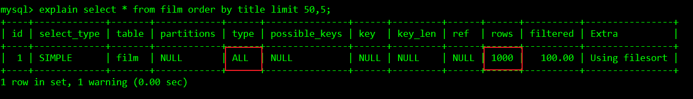
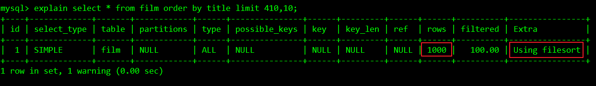
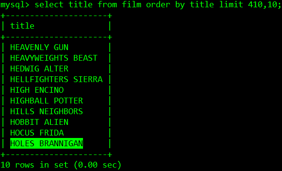
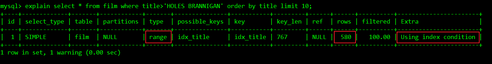

# 嵌套查询优化

## 目录

- [优化嵌套查询](#优化嵌套查询)
- [优化分页查询](#优化分页查询)
- [总结](#总结)

## 优化嵌套查询

嵌套查询（子查询）可以使用SELECT语句来创建一个单列的查询结果，然后把这个结果作为过滤条件用在另一个查询中。嵌套查询写起来简单，也容易理解。但是，有时候可以被更有效率的连接（JOIN)替代。

现在假如要找出从来没有在网站中消费的客户，也就是查询在客户customer表中但是不在支付payment表中的客户信息。

**嵌套查询：**

```
explain select * from customer where customer_id not in (select customer_id from payment);
```



**连接改写：**

```
explain select * from customer a left join payment b on a.customer_id = b.customer_id where b.customer_id is null;
```



画外音：

连接查询效率更高的原因

- 是因为MySQL**不需要在内存中创建临时表**来完成这个逻辑上需要两个步骤的查询工作；

- 并且**Not exists**表示MYSQL优化了LEFT JOIN，一旦它找到了匹配LEFT JOIN标准的行， 就不再搜索了。

## 优化分页查询

在MySQL中做分页查询，MySQL 并不是跳过 offset 行，而是取 offset+N 行，然后返回放弃前 offset 行，返回 N 行，那当 offset 特别大的时候，效率就非常的低下。例如“limit 1000,20”，此时MySQL排序出前1020条数据后仅仅需要第1001到1020条记录，前1000条数据都会被抛弃，查询和排序的代价非常高。由此可见MySQL的分页处理并不是十分完美，需要我们在分页SQL上做一些优化，要么**控制返回的总页数**，要么对**超过特定阈值的页数进行 SQL 改写**。

画外音：控制返回的总页数并不是那么靠谱，毕竟每页的数据量也不能过大，数据多起来之后，控制返回的总页数就变的不现实了。所以还是要**对超过特定阈值的页数进行 SQL 改写**。

现在假设要对电影表film排序后取某一页数据

```
explain select * from film order by title limit 50,5;
```



可以看到优化器实际上做了全表扫描，处理效率不高。

### 第一种优化思路

**在索引上完成排序分页的操作，最后根据主键关联回表查询所需要的其他列内容。**

画外音：此处涉及到了SQL优化的两个重要概念，**索引覆盖和回表**，我在前面的文章中详细介绍过这两个概念。通过索引覆盖在索引上完成扫描和排序（索引有序），最后通过主键（InnoDB引擎索引会通过主键回表）回表查询，最大限度减少回表查询的I/O次数。

```
explain select * from film a inner join (select film_id from film order by title limit 50,5)b on a.film_id = b.film_id;
```


### 第二种优化思路

**把LIMIT查询转换成某个位置的查询，减少分页翻页的压力。**

假设现在每页10条数据，要取第42页的数据。

```
explain select * from film order by title limit 410,10;
```



现在需要多传一个参数，就是上一页（第41页）的最后一条数据的主题title，



SQL可以改写为：

```
explain select * from film where title>'HOLES BRANNIGAN' order by title limit 10;
```



这样就把LIMIT m,n 转换成了LIMIT n的查询，但是这种方案只适合在不会出现重复值的特定环境，否则分页结果可能会丢失数据。

## 总结

对于嵌套查询和分页查询的优化，归根结底就是遵循SQL优化原则之一——减少回表查询的I/O次数。对于分页查询优化，更建议使用第一种优化方案，性能更好，稳定性更高。