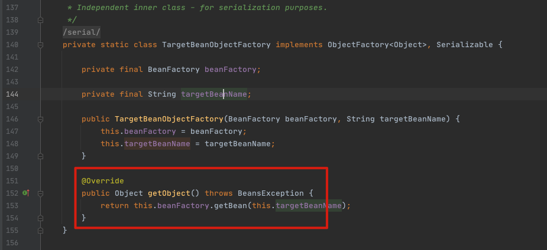

# 005-ObjectFactory与BeanFactory的区别

[TOC]

## 简介

ObjectFactory与BeanFactory均提供依赖查找的能力

- ObjectFactory仅仅关注一个或者一种类型Bean的依赖查找,并且自身不具备依赖查找的能力,能力由BeanFactory输出,常常使用的类为ObjectProvider
- BeanFactory则提供了单一类型、集合类型以及层次性等多种依赖查找方式

```
org.springframework.beans.factory.config.ObjectFactoryCreatingFactoryBean.TargetBeanObjectFactory
```




