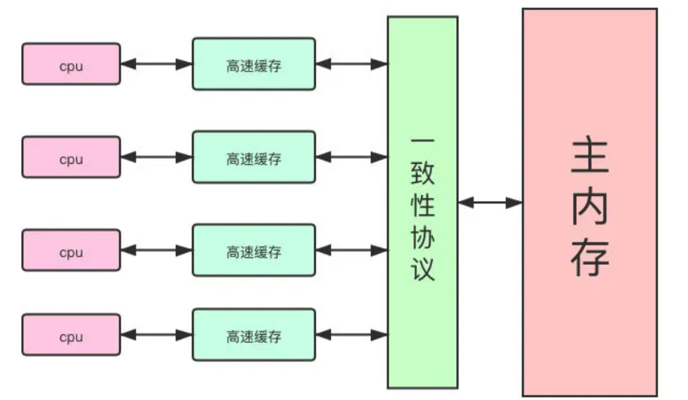
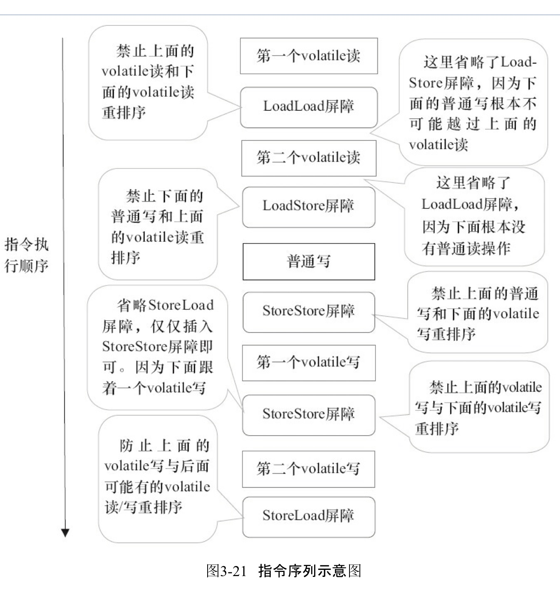

# 并发编程

## 什么是 JMM



Java内存模型是一个抽象模型,并不真实存在

主要定义了线程和主内存之间的抽象关系

> 线程之间的共享变量存在主内存中,每个线程的本地内存都存储了一个副本

#### JMM 解决了什么问题

- 线程之间如何通讯
- 线程之间如何同步

#### 线程之间如何通讯       

- 线程 A 更新完本地内存后刷新到主内存
- 线程 B 从主内存读取这个更新后的值

#### 如何解决一致性问题

- MESI 协议

> 当CPU写数据时，如果发现操作的变量是共享变量，即在其他CPU中也存在该变量的副本，会发出信号通知其他CPU将该变量的缓存行置为无效状态，因此当其他CPU需要读取这个变量时，发现自己缓存中缓存该变量的缓存行是无效的，那么它就会从内存重新读取。

- 如何发现自己失效

> 每个处理器通过嗅探在总线上传播的数据来检查自己缓存的值是不是过期了，当处理器发现自己缓存行对应的内存地址被修改，就会将当前处理器的缓存行设置成无效状态，当处理器对这个数据进行修改操作的时候，会重新从系统内存中把数据读到处理器缓存里。


## 指令重排序

#### 什么是重排序

编译器和处理器为了优化性能对指令序列进行重新排序的手段

- 编译器重排序

> 编译器在不改变单线程程序语义的前提下，可以重新安排语句的执行顺序;

- 指令重排序

> 如果不存在数据依赖性,处理器可以改变语句对应机器指令的执行顺序

- 内存系统重排序

> 由于处理器使用缓存和读/写缓冲区，这使得加载和存储操作看上去可能是在乱序执行的

2 和 3 属于处理器重排序 , JMM 要求使用内存屏障来禁止特定的重排序

## as-if-serial

不管怎么重排序，单线程下的执行结果不能被改变。

编译器、runtime和处理器都必须遵守as-if-serial语义


## 内存屏障

#### 什么是内存屏障

- loadload

> 确保 load1 数据的装载先于 load2

- loadstore

> 确保 load 操作先于 store 操作,store 操作的是 load 的最新数据

- storestore

> 确保 store1 刷新到主内存先于 store2 刷新到主内存

- storeload , 全能型指令,同时具备其他三种的效果,开销昂贵

> 确保 store1 数据对其他处理器课件,先于 load2 以及其后去装载的指令

## 什么是 happens-before

>  [07-happens-before.md](../04-java/03-concurrency/05-Java内存模型/07-happens-before.md) 

是 JMM 提出的一个内存可见性的保证, 但是学习难度比价复杂,所以通过 happens-bofore 一系列规则来帮助程序员快速理解内存可见性

- 程序顺序规则: 一个线程中的每个操作,happens-before 于该线程中的任意后续操作
- 监视器锁规则: 对一个锁的解锁, happens-before 于随后对这个锁加锁
- volatile 变量规则: 对一个 volatile 域的写,happens-before 于任意后续对这个 volatile 域的读
- 传递性: 如果 A happens-before B , 且 B happens-before C , 那么 A 一定 happens-before C
- start 规则:  如果线程 A执行操作 ThreadB.start(),那么A 线程的 ThreadB.start()操作happen-before 线程 B 中的任意操作
- join 规则: 如果线程 A 执行ThreadB.join().那么线程 B 中的任意操作 happen-before与线程 A 从ThreadB.jion 操作成功返回


## as-if-serial

不管怎么重排序,单线程的执行结果不能被改变

## volatile 关键字

#### what

- 确保可见性
- 禁止重排序

#### 什么是可见性

JMM 实际上是有一个主内存和一系列本地内存组成的,本地内存从主内存拷贝变量到本地进行运算后再保存到主内存,多个线程下,多个副本会出现不一致的情况,这个时候就需要可见性机制

volatile 两个操作

- 将本地内存修改到主内存
- 使其他内存对这个变量的副本失效

volatile 关键字确保了共享变量在多线程下的可见性,它相对于 synchronzined 关键字,成本更低,不会引起线程上下文的切换,比较适合控制并发的开关,不适合修饰累加等操作

> 因为在操作时我们往往会认为 volatile 关键字能够实现多线程的可见性而对他进行累加等操作,实际上这个是线程不安全的,比如 volatile ++ 操作,你用 javap 反编译后就会发现实际上并不是原子的

#### volitile 为什么能够保证可见性

- 写一个 volatile 变量时,JMM 会把该线程对应的本地内存中的共享变量值刷新到主内存
- 当读一个 volatile 变量时,JMM会把线程对应的本地内存置为无效,从主内存中读取共享变量

https://mp.weixin.qq.com/s?__biz=MzAwNDA2OTM1Ng==&mid=2453142004&idx=1&sn=81ccddb6c8b37114c022c4ad50368ecf&scene=21#wechat_redirect

#### volatile 的简要使用场景

> 1. volatile修饰符适用于以下场景：某个属性被多个线程共享，其中有一个线程修改了此属性，其他线程可以立即得到修改后的值，比如booleanflag;或者作为触发器，实现轻量级同步。
> 2. volatile属性的读写操作都是无锁的，它不能替代synchronized，因为它没有提供原子性和互斥性。因为无锁，不需要花费时间在获取锁和释放锁_上，所以说它是低成本的。
> 3. volatile只能作用于属性，我们用volatile修饰属性，这样compilers就不会对这个属性做指令重排序。
> 4. volatile提供了可见性，任何一个线程对其的修改将立马对其他线程可见，volatile属性不会被线程缓存，始终从主 存中读取。
> 5. volatile提供了happens-before保证，对volatile变量v的写入happens-before所有其他线程后续对v的读操作。
> 6. volatile可以使得long和double的赋值是原子的。
> 7. volatile可以在单例双重检查中实现可见性和禁止指令重排序，从而保证安全性

#### long 个 double 类型的特殊规则

long和 double 的非原子性协议

他们俩都是 64 位,jmm 中规定:允许 long 和 double 这两个64 位的类型,在没有 volatile 修饰的情况下,划分为两个 32 位操作,允许虚拟机实现选择可以不保证原子性

有可能多线程读的时候,会出现读到一半的值,但是在主流商业虚拟机都实现了这个操作的原子性,所以我们不需要加 volatile 关键字

#### volatile 应用实例

- 双检锁, 分配内存后初始化内存和指针指向非原子操作导致的安全问题
- 生产者消费者模型中,线程关闭 flag

#### volatile 如何禁止重排序

插入内存屏障

- 写前 ss, 写后 storeload

- 读后 loadload , loadstore



#### 什么是重排序,都有哪几种?

#### final 重排序的语义

#### 什么是顺序一致性模型

#### 双检锁与延迟加载,为什么要有双检锁,内部类生命方式更好?

#### 什么是 happen-before

> 

#### volatile 的内存语义

> https://mp.weixin.qq.com/s?__biz=MzAwNDA2OTM1Ng==&mid=2453142004&idx=1&sn=81ccddb6c8b37114c022c4ad50368ecf&scene=21#wechat_redirect

#### 锁的内存语义

 [05-Java内存模型](../04-java/03-concurrency/05-Java内存模型) 

## 线程基础

什么是线程

启动一个 Java程序,操作系统就会创建一个 Java 进程,一个进程可以创建多个线程,

**这些线程有自己的程序计数器,堆栈和局部变量等属性,能够访问共享的内存变量**

处理器在这些线程上高速切换,看起来像是在同时运行

#### Java 线程有几种状态


#### 为什么要使用多线程

- 因为处理器核心变多了,使用多线程技术可以将计算逻辑分配到多个处理器核心上,就会明显减少程序的处理事件
- 更快的相应时间,可以把非事务请求进行多线程操作,获得更快的相应时间
- 更好的编程模型

#### 线程优先级

可以通过 setPriprity 修改优先级,优先级的范围从 1-10 ,但是有些操作系统会忽略优先级,所以我们写代码的时候,程序的正确性不能依赖线程的优先级高低

#### 创建线程的方法

- 实现 Runnable 接口
- 继承 thread 类 ,一样也是实现了runnable 接口
- 实现 callable 接口 , 有返回值

#### 过期的 suspend()方法,resume ()方法和 stop 方法

不释放资源

替代方案

- suspend  , resume 使用等待通知机制
- stop 使用信号量方式

#### 如何安全地终止线程

使用`Thread.currentThread().isInterrupted()`判断

```
public class Shutdown {
    public static void main(String[] args) throws Exception {
        Runner one = new Runner();
        Thread countThread = new Thread(one, "CountThread");
        countThread.start();
        // 睡眠1秒，main线程对CountThread进行中断，使CountThread能够感知中断而结束
        TimeUnit.SECONDS.sleep(1);
        countThread.interrupt();
        Runner two = new Runner();
        countThread = new Thread(two, "CountThread");
        countThread.start();
        // 睡眠1秒，main线程对Runner two进行取消，使CountThread能够感知on为false而结束
        TimeUnit.SECONDS.sleep(1);
        two.cancel();
    }

    private static class Runner implements Runnable {
        private long             i;

        private volatile boolean on = true;

        @Override
        public void run() {
            while (on && !Thread.currentThread().isInterrupted()) {
                i++;
            }
            System.out.println("Count i = " + i);
        }

        public void cancel() {
            on = false;
        }
    }
}
```


#### 

#### 等待通知范式

等待超时模式

#### Thread.join 机制